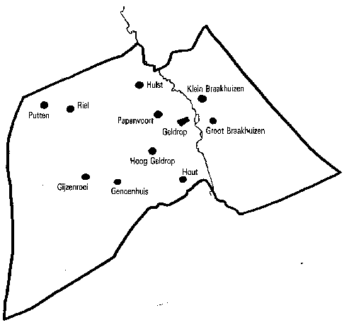

### Geschiedenis

## Gijzenrooi, verleden en heden
Voor de historie van Gijzenrooi moeten we terug naar Zesgehuchten in Geldrop.

Geldrop was een zogenaamde heerlijkheid, leenroerig aan de hertog van Gelre. Dat wil zeggen dat de Heer van Geldrop bepaalde rechten had over de Geldroppenaren en dat hij een leenband had met de hertog van Gelre, die hij trouw beloofde. Ook andere plaatsen in de omtrek waren heerlijkheden, zoals Heeze, Mierlo, Nuenen en Helmond. De heerlijkheid Geldrop was qua omvang kleiner dan de parochie Geldrop, waartoe ook Zesgehuchten behoorde. De macht van de Heer strekte zich uit over de gehuchten Grote en Kleine Heuvel en Groot en Klein Braakhuizen. De zogenaamde Zesgehuchten, te weten Genoenhuis, Riel, Hoog Geldrop, Hout, Hulst en Gijzenrooi maakten deel uit van de heerlijkheid Heeze- Leende-Zesgehuchten.
Het oorspronkelijke Gijzenrooi, het Geldropse gehucht behorende bij Zesgehuchten ligt vijftien honderd meter zuidoostelijk van het Eindhovense Gijzenrooi, het gebied rond de kampeerboerderij 'Het Uilenest'.

*De ligging van de Zes gehuchten en Geldropse buurtschappen. De grens geeft de omvang van de gemeente aan, zoals die was in 1921. In het westen grensde Zesgehuchten aan Stratum*

Op bestuurlijk gebied waren Geldrop en Zesgehuchten in de 17de en 18de eeuw zelfstandige dorpen, maar in de praktijk was er een verregaande samenwerking, die vooral tot uiting kwam in het gezamenlijk bekostigen van bepaalde voorzieningen. Zesgehuchten had slechts weinig voorzieningen; Voor een raadkamer, molen, school of kerk was het afhankelijk van omliggende gemeenten.
Kort na de eerste wereldoorlog stegen de gemeentelijke uitgaven onrustbarend. Woningbouw, aanleg van electriciteit en riolering brachten heel wat gemeenten in financiële moeilijkheden en in veel gevallen moest worden samengewerkt in het bekostigen van de infrastructuur. In heel wat dorpen hebben deze extra uitgaven geleid tot annexatie. Op 1 januari 1920 werden de gemeenten Stratum, Gestel, Strijp, Tongelre en Woensel bij Eindhoven gevoegd, terwijl Geldrop en Zesgehuchten op 29 april 1921 werden samengevoegd onder de naam Geldrop.
De Grens tussen Geldrop en Eindhoven liep ter hoogte van de huidige Petrus Canisiustaat, Tivolilaan, Floralaan-Oost en Rendierveld. Zowel aan Eindhovense als aan Geldropse zijde was dit grensgebied nog onontgonnen.

### Tivoli
Door de groei van de N .V. Philips was er een voortdurend tekort aan woningen in Eindhoven. Volgens de Woningwet mocht het Rijk alleen subsidie of leningen verstrekken aan woningbouwverenigingen, vandaar dat op 1 december 1927 de woningbouwstichting " Thuis Best" werd opgericht. Deze stichting bouwde tussen 1928 en 1930 maar liefst 2205 woningen in Eindhoven en de aangrenzende gemeenten Geldrop, Aalst-Waalre en Son. De voorkeur werd gegeven aan bouwterreinen die aan de gemeente Eindhoven grensden, zonder dat men zich daar hoefde te storen aan de strenge woningbouweisen van de gemeente Eindhoven.
In mei 1928 kocht " Thuis Best" de bossen van het landgoed " Tivoli" van baron Van Tuyll van Serooskerken uit Geldrop. Tivoli was gelegen tussen de Putten en Riel en de grens met Stratum. Na enig overleg met de gemeente Geldrop verkreeg de woningbouwstichting toestemming om daar huizen te bouwen. De gemeente Geldrop was op de hoogte van het feit dat " Thuis Best" op Tivoli wilde bouwen om de Eindhovense eisen met betrekking tot de rioleringen, verlichting en andere voorzieningen te ontduiken, vandaar dat de gemeente speciale clausules over deze kosten in het contract liet opnemen. Een andere zorg van de gemeente was het feit dat hier een enorme arbeiderswijk werd gerealiseerd, wat wel eens een grote last kon worden voor het Burgerlijk Arm-bestuur als er een tijd van werkloosheid aanbrak. In een geheime overeenkomst werd bepaald dat de N .V. Philips een bijdrage zou geven aan de gemeente Geldrop in de eventuele meerkosten van de armenzorg.

In 1929 kon met de bouw worden begonnen en eind van dat jaar trokken de eerste gezinnen in hun nieuwe huizen. Het overgrote deel van de inwoners van Tivoli was afkomstig uit Eindhoven en werkzaam bij Philips, er woonden praktisch geen Geldroppenaren. De bevolking was geheel aangewezen op de gemeente Eindhoven, ofschoon zij in Geldrop woonachtig waren. Geboorten, huwelijken en overlijdens moesten zij in Geldrop aangeven en ook voor de verkiezingen werden zij tot Geldrop gerekend.
Parochieel maakte de nieuwe wijk deel uit van de Maria en Brigidaparochie Zesgehuchten, maar op 24 oktober 1929 werd er een rectoraat gevestigd in Tivoli van de Societas Missionarium Sacratissimi Cordis (M.S.C.). De eerste rector van Tivoli was pater G. H. J. M. Baptist. Hij moest zich voorlopig behelpen met een kapelletje in een van de woonhuizen, namelijk Leeuwenstraat 5. Deze ruimte was net groot genoeg voor dertig personen.

In 1930 groeide het aantal inwoners van Tivoli tot 1580. In totaal waren er 458 huizen bewoond. Het was opmerkelijk dat ondanks de woningnood nog 56 huizen leeg stonden. Dit had te maken met de crisis die eind 1929 tot werkloosheid had geleid en de hogere belasting in Geldrop. Op grond van deze beide factoren was het verloop in Tivoli erg groot en werden de plannen van Philips bijgesteld. In 1931 waren er onder de bewoners zelfs 80 werklozen en stonden er 153 woningen leeg!

Op 20 januari 1930 werd begonnen met de bouw van een noodkerk op het Arnaudinaplein, welke op 30 maart 1930 werd geopend. De naam Arnaudinaplein, die op 1 maart werd vastgesteld, was ontleend aan Arnaudina Hoevenaar, de echtgenote van baron Van Tuyll van Serooskerken.
De overige straatnamen werden enkele maanden later vastgesteld, te weten: Neushoornstraat. Leeuwenstraat. Panterstraat. Zebrastraat. Tapirstraat. Tijgerstraat. Poemastraat. Bisonstraat. Berenstraat en Luipaardstraat.
In februari 1930 werden de huizen op Tivoli van elektriciteit voorzien. Een andere belangrijke voorziening was de bouw van een school. Deze kwam in april 1930 klaar.
In 1940 werd de eerste steen gelegd voor een kerk aan de Heezerweg onder Eindhoven, waartoe Tivoli parochieel ging behoren. De band met Geldrop werd zodoende nog losser .

In 1967 kreeg Tivoli een eigen wijkraad, die de Geldropse gemeenteraad ging adviseren en die de meningen en wensen van de inwoners van Tivoli zou peilen ten aanzien van de annexatie door Eindhoven.
Met ingang van 1 april 1972 verloor Geldrop 4650 inwoners aan Eindhoven. Tivoli, Riel en Putten behoorden sinds die datum tot Eindhoven, Gijzenrooi bleef bij Geldrop. Ook de DAF-fabrieken kwamen binnen de nieuwe gemeentegrens van Eindhoven te liggen.

### Huidige Gijzenrooi
Begin jaren tachtig ontwikkelde de gemeente Geldrop het plan Gijzenrooi. Aanvankelijk zou het gehele gebeid tussen Geldrop en Eindhoven worden volgebouwd, maar naarmate de jaren vorderden werd het plan steeds bijgesteld. De gemeenteraad van Geldrop en Eindhoven ontmoetten veel tegenstand van milieubeschermers die het prachtige landschap tussen Geldrop en Eindhoven wensten te handhaven.. Zij kregen steun van heemkundigen, die vochten voor het behoud van de gehuchten Genoenhuis, Gijzenrooi en Riel.
In 1987 realiseerde Geldrop een klein gedeelte van het plan Gijzenrooi, onder de naam "de Bronzenwei" en tot heden heeft Geldrop uitgebouwd tot ver in Genoenhuis.
Maar ook van Eindhovense zijde werd bezwaar gemaakt tegen de aantasting van de natuur door de bebouwing van het groene gebied tussen Eindhoven en Geldrop en met name Gijzenrooi. Een groep Stratummers sloegen de handen in een en richtte een werkgroep op met de naam Werkgroep Behoud Gijzenrooi om zich te verzetten tegen het plan van eindhoven om 1000 woningen te realiseren in Gijzenrooi. Dit verzet heeft (gelukkig? / helaas?) niets opgeleverd zodat Eindhoven in de jaren negentig ons Gijzenrooi kon realiseren.

(Tekst: Henk Lingers)
