## De boerderijen op Riel
Door figuratieve schilder [Titia Droog](http://titia.eu) zijn de boerderijen van Riel in aquarel vereeuwigd.

### Riel 1
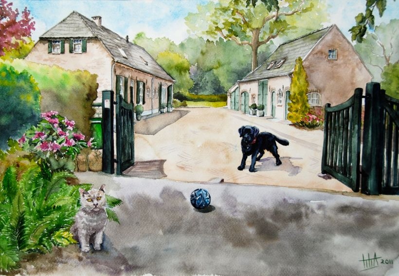

Riel 1 - Oude langgevelboerderij ging verloren bij de grote brand van 1876, werd weer opgebouwd en in 1910 weer gedeeltelijk door brand getroffen. Bij de herbouw werd de boerderij iets verhoogd, maar het karakter was grotendeels zoals in 1876. Tot 1990 werd er vee gehouden en tot ongeveer 2000 kippen. De huidig woonboerderij en schuur zijn in 2003 ingrijpend verbouwd

### Riel 2
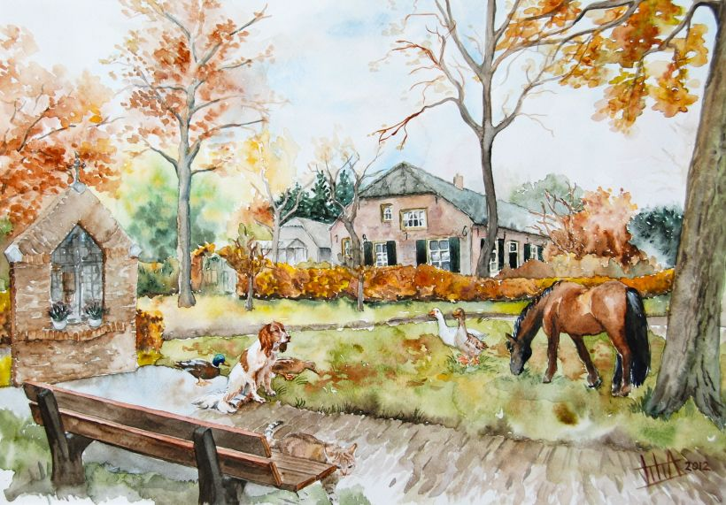

Riel 3 - Deze boerderij dateert uit 1876 en is daarna slechts enkele keren licht verbouwd. De boerderij en de schuur staan op de lijst van de rijksmonumenten. Het kapelletje is in 2008 gebouwd

### Riel 3
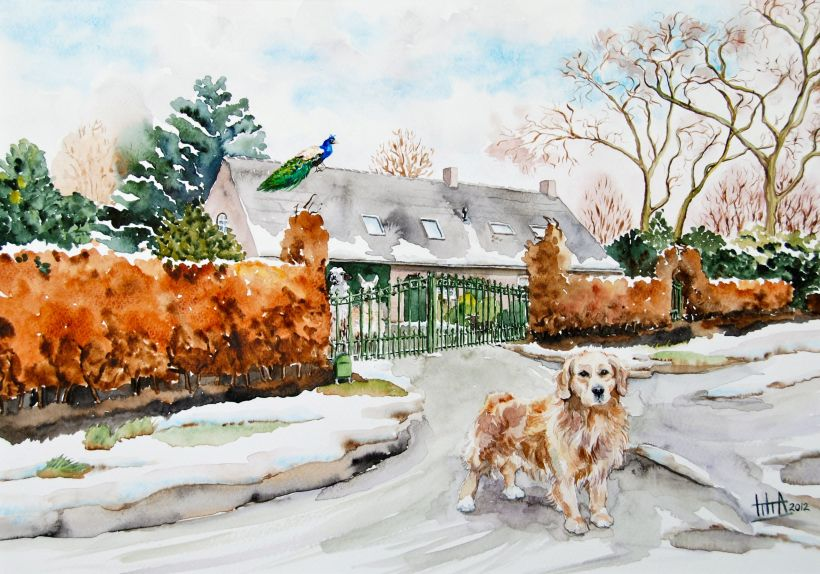

Riel 3 - Langgevelboerderij werd op de fundamenten van een zeer oude boerderij gebouwd. Tot ongeveer 1960 heeft het als een boerenbedrijf gefunctioneerd. Nu als woonboerderij in gebruik en vanaf 1996 meerdere malen wat veranderd.

### Riel 4
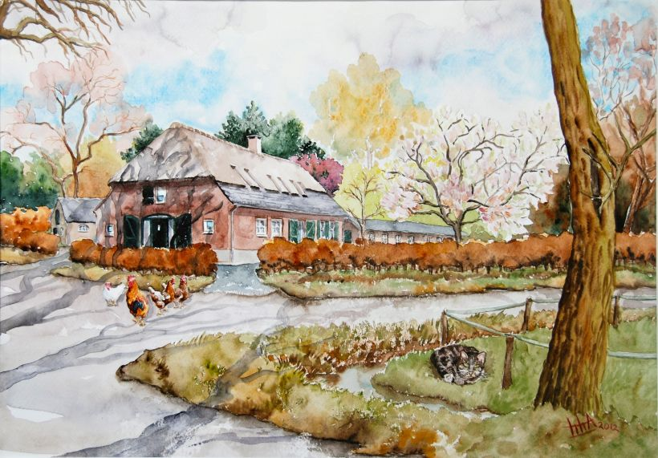

Riel 4 - Hier stond een oude boerderij die als schuur in gebruik was toen er omstreeks 1953 een modern woonhuis van 2 verdiepingen naast werd gebouwd. Het erachter gelegen langgerekte gebouwtje uit 1954 was het kippenhok. In 2007 werd de schuur weer in boerderijvorm herbouwd als woonhuis en werd het afwijkende twee verdiepingen huis afgebroken

### Riel 5
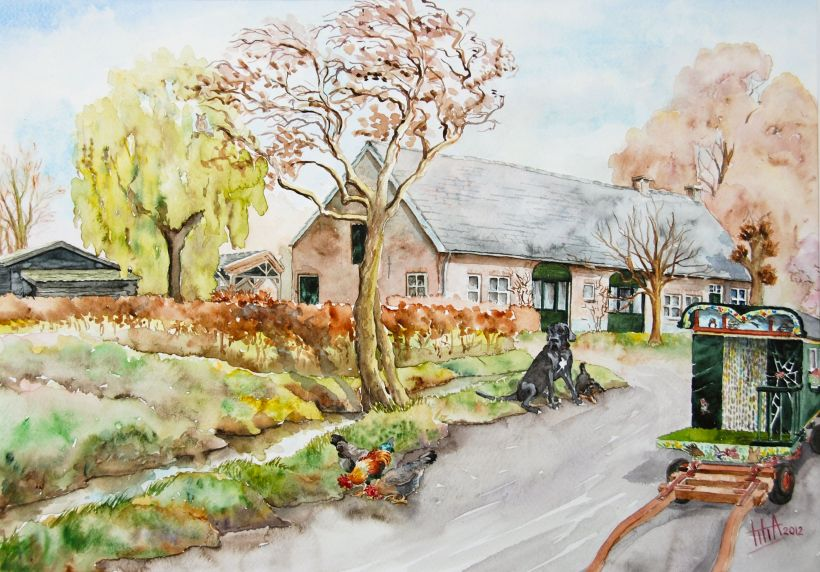

Riel 5 - Eigenlijk de schuur van een er tegenoverliggende boerderij die in de jaren 60 is afgebroken. Ergens in de jaren 20/30 werd de schuur met een woonhuis verlengd. Begin jaren 90 is het geheel tot woonhuis verbouwd. De bijgebouwen zijn in 2010/2011 aangepast

### Riel 7
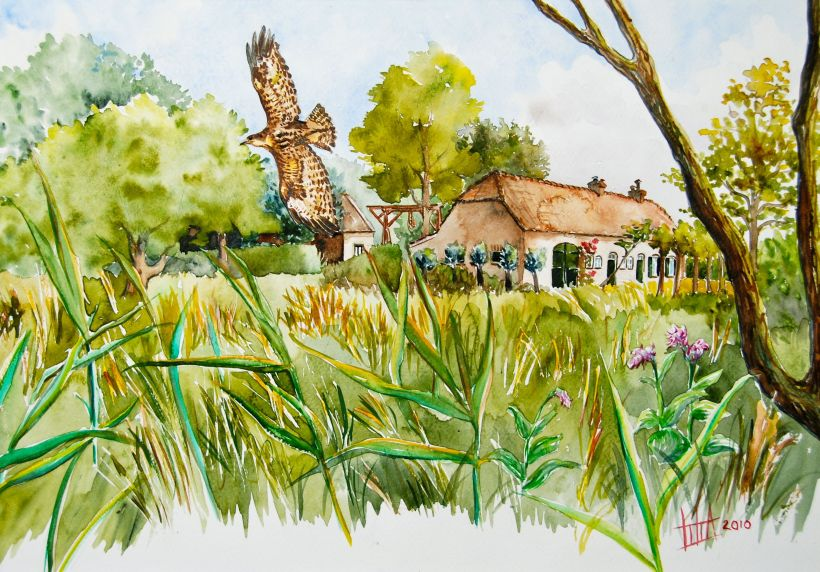

Riel 7 - Hier liggen de fundamenten van het vroegere speelhuis (jachthuis). De latere boerderij brandde in 1944 af. De huidige boerderij en schuur werden herbouwd en hebben nu een woonfunctie.

### Riel 8
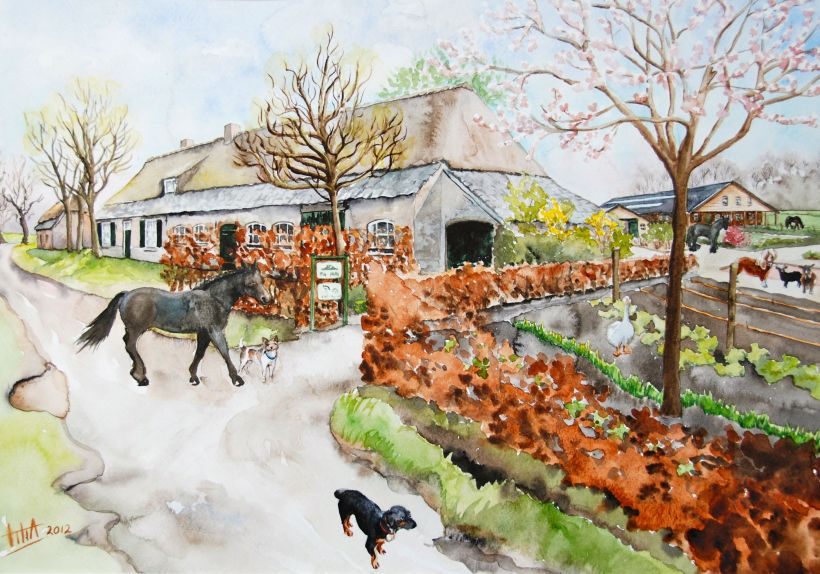

Deze boerderij, gebouwd in 1881, ligt vrijwel op de plaats van de oude boerderij en is een gemeentelijk monument. Tot de MKZ crisis van 1997 werden hier varkens gehouden. Sinds 2003 is het een paardenhouderij en na 2007/2008 ook een zorgboerderij.

### Riel 9
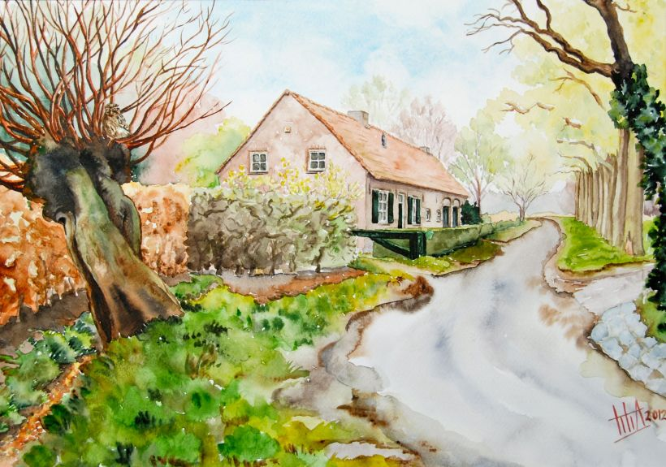

Langgevelboerderij, ook op de plaats van een afgebrande boerderij, in 1899 gebouwd. Werd in 1901 verbouwd en heeft tot de jaren 70 gefunctioneerd als boerenbedrijf. Daarna tot het huidige woonhuis verbouwd

### Riel 10
<!--  -->

Riel 10 - Langgevelboerderij, in 1879 gebouwd op de plaats van een oudere boerderij. Heeft nog steeds een agrarische functie.

### Riel 11
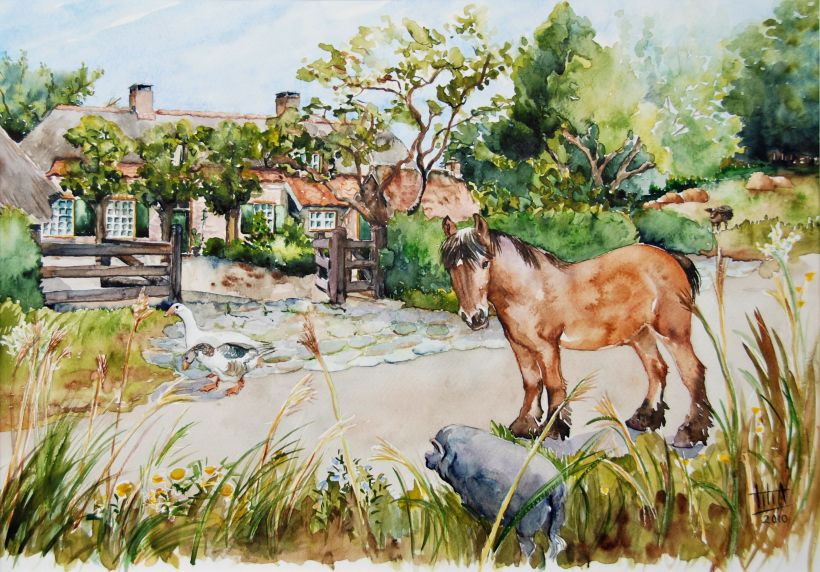

Riel 11 - Oorspronkelijke boerderij gebouwd in 1865/1866 langs de Lakerloop. Afgebrand in 1984. In 1985 samen met een bakhuisje en houten schop weer herbouwd

### Riel 12
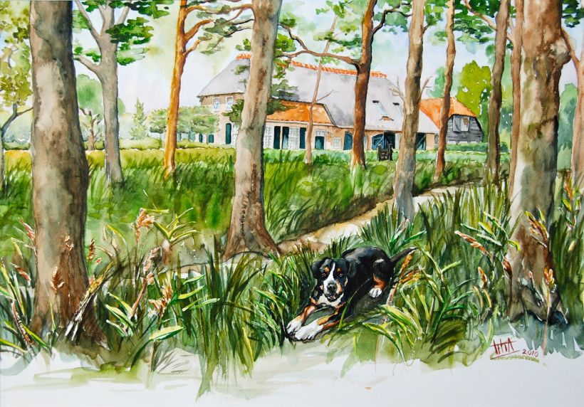

Riel 12 - Hier stond vroeger een boerderij die verdwenen was en daarom mocht er in 2006/2007 de huidige boerderij met schuur gebouwd worden. Woonboerderij

### Riel 13
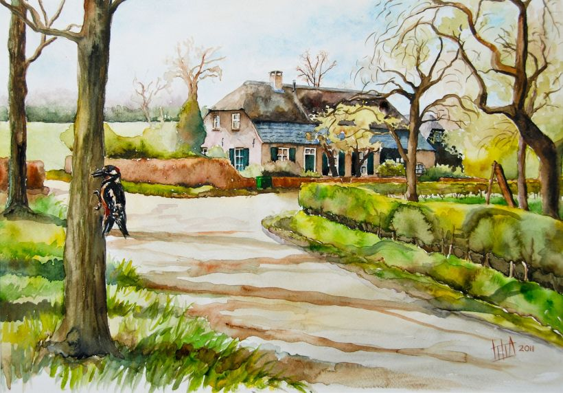

Riel 13 - Deze boerderij is in 1882 gebouwd en staat op de rijksmonumentenlijst. De houten schuur is er eind jaren 90 bijgebouwd.

### Riel 14
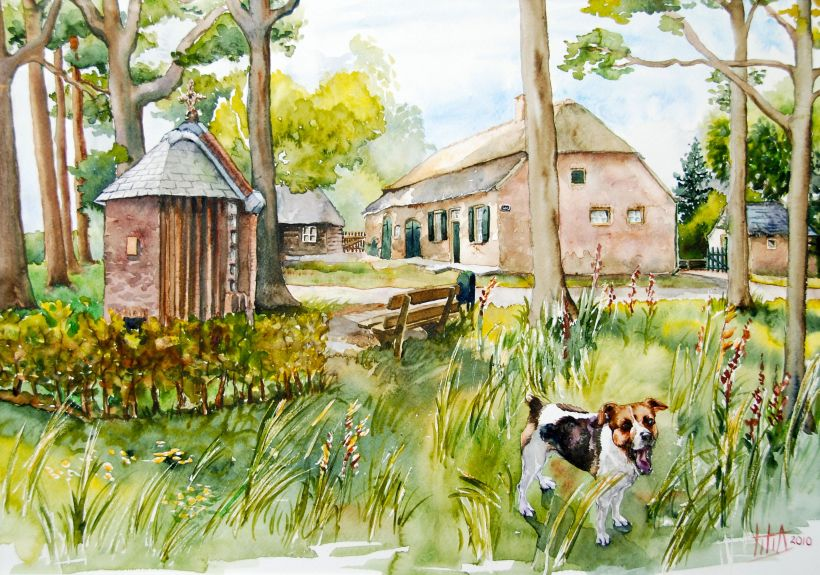

Riel 14 - Langgevel op de plaats van een zeer oude boerderij, vermoedelijk uit de 17e eeuw. De boerderij werd in 1876 verwoest, maar is in de oorspronkelijke stijl herbouwd. Boerderij en bakhuis staan op de rijksmonumentenlijst. De schop is in de tweede helft van de jaren 90 in stijl gerestaureerd. Hier is de achterkant van het kapelletje
uit 2008 te zien.

### Riel 20
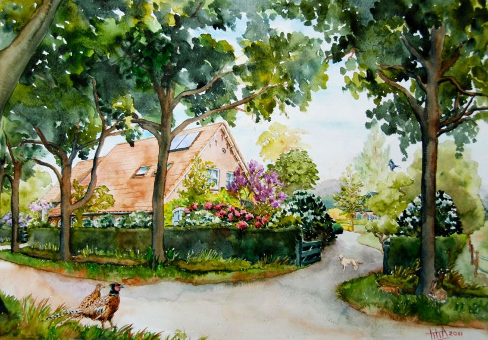

Rielsedijk 20 - Na de brand van 1921 werd deze boerderij herbouwd in afwijkende stijl. Het werd een Gelderse boerderij, aangezien de eigenaar uit Gelderland kwam. Heeft tot de verbouwing in 1974 als boerenbedrijf gefunctioneerd. Nu woonhuis en in 1997 is de schuur passend bij het huis gebouwd.

### Riel 21
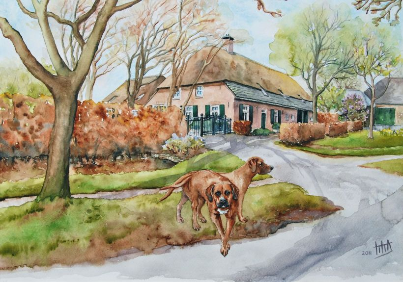

Rielsedijk 21 - Na de brand van 1876 werd de boerderij gebouwd op de fundamenten van een veel oudere boerderij en stond op de lijst van rijksmonumenten. In 1991 brandde de boerderij af. De huidige langgevel dateert uit 2001.

### Riel 22
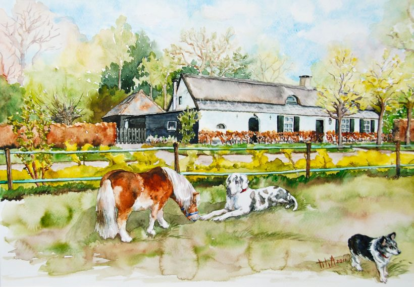

Rielsedijk 22 - Deze langgevelboerderij was aan het begin van de 20e eeuw nog een boerenwoning. De huidige stenen boerderij is verbouwd tot woonhuis

### Riel 22a
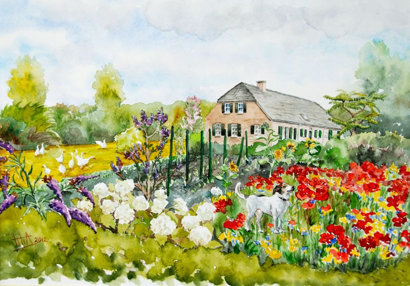

Rielsedijk 22a - Oorspronkelijke boerderij brandde af in 1921 en werd toen niet herbouwd. Pas in 2002 werd de huidige woonboerderij gebouwd.

### Riel 22b
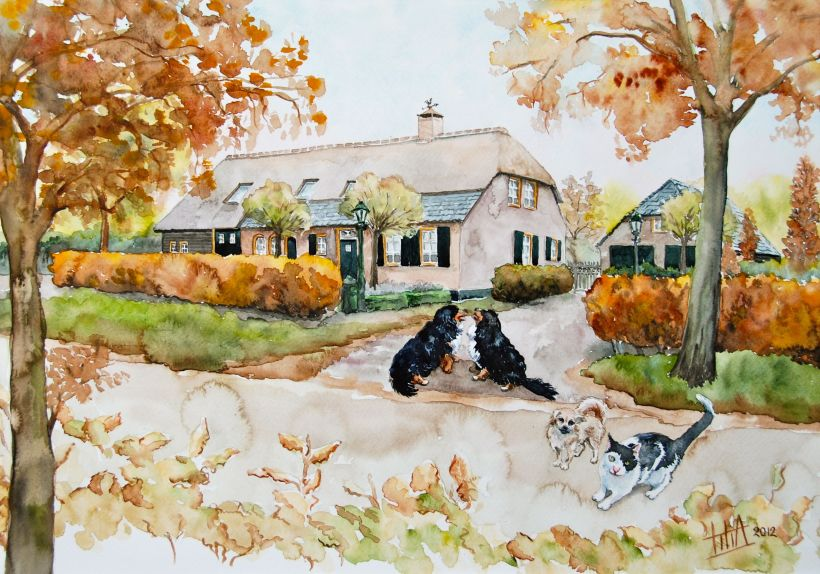

Rielsedijk 22b - Deze woonboerderij met schuur werd in 2003, wat verder naar de hoek dan vroeger, gebouwd.

### Riel 23
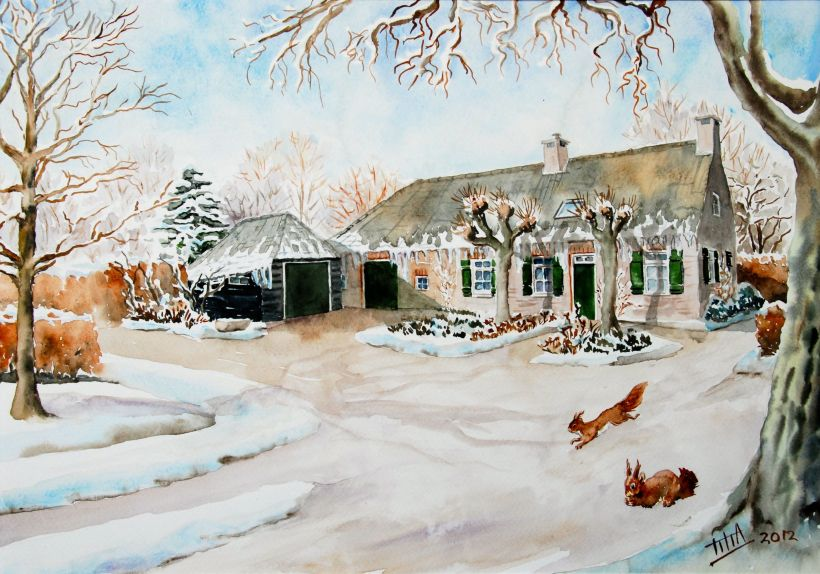

Rielsedijk 23 - Landarbeiderswoning die ook in 1876 afbrandde. Hij is herbouwd in steen en is in 1985 verbouwd tot het huidige huis. In 1988 is de houten schop er naast gezet.

### Riel 24
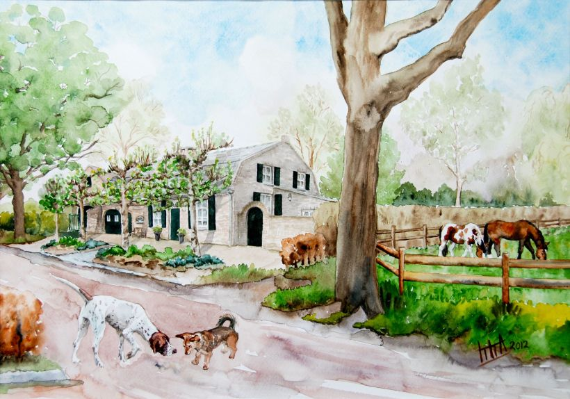

Rielsedijk 24 - Boerderijachtig woonhuis met mansarde kap. Een paar keer wat veranderd en in 2007 werd de schuur gebouwd.

