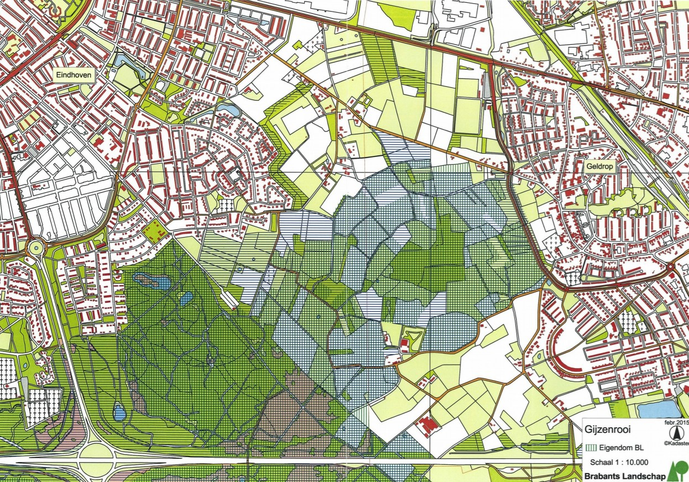
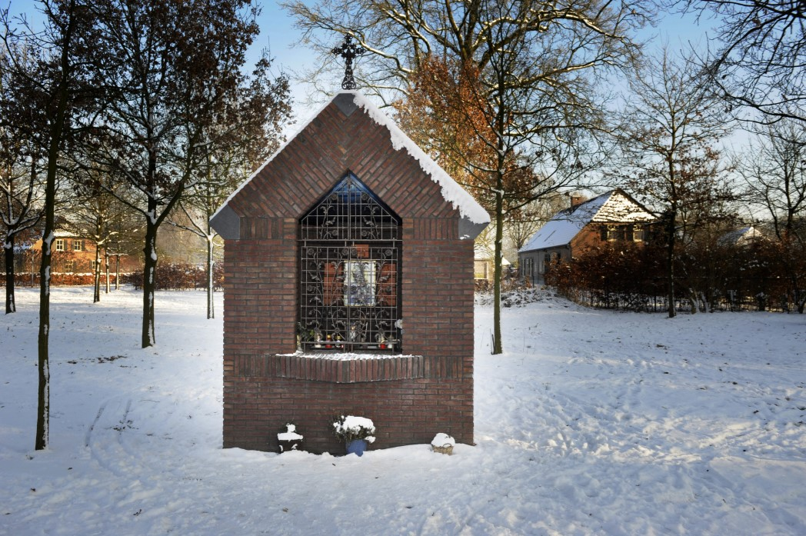
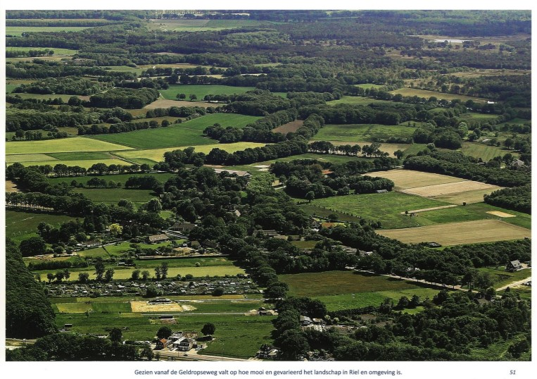
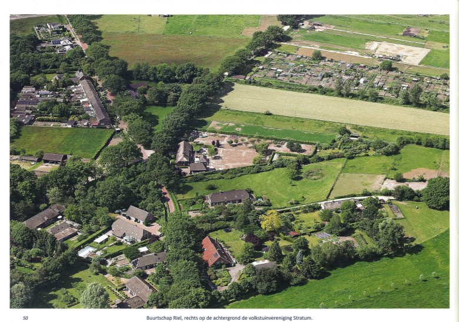
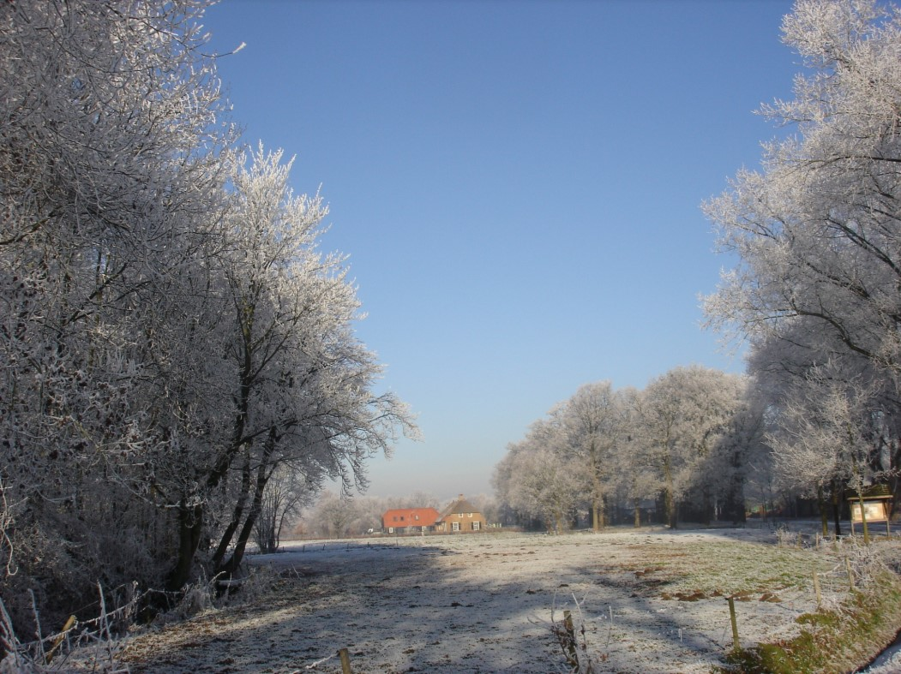

###### Visie op Riel 2015

## RIEL, PAREL VAN DE ZESGEHUCHTEN. Toekomstvisie 2015
Datum: 14 januari 2016  
Commissie: Wilbert Gooskens, Peter van de Moosdijk en Harry Droog

### Doel van de VISIE 

Voor de bewoners van Riel beoogt de toekomstvisie:

1. het toetsingskader te zijn voor : 
   - de ontwikkelingen, besluitvorming en planvorming voor het “gebied” 
   - het onderhoud en handhaving van de afspraken/regelgeving voor het gebied 
   - relevante aspecten van de nabije omgeving

2. de basis te vormen voor een programmatische aanpak

### Gebied 
- Het “gebied” betreft Riel conform het “Beschermd Dorpsgezicht Riel” en de nabije omgeving, omdat ontwikkelingen aldaar van invloed (kunnen) zijn op Riel. 
- Dit gebied is grotendeels onderdeel van de groene (noord-zuid) corridor tussen Eindhoven en Geldrop. Veel van het gebied is het eigendom van “Brabants Landschap”. 
- Daarbij bevindt de beperkte bewoning zich vooral in Eindhoven (“Buurtschap Riel”) en veel van het natuurgebied in Geldrop.

  
*Eigendommen van Brabants landschap (feb 2015)*

### Kenmerken van het gebied.
Riel heeft een UNIEK KARAKTER met een rijke geschiedenis.

Deze rijke geschiedenis is nog herkenbaar aan: 
- ontginning vanaf de 7de eeuw 
- ontstaan van bolle akkers 
- ontwikkeling van kransakkerdorp

Met als historische overblijfselen: 
- beperkt aantal echt oude boerderijen, veelal in dezelfde dezelfde stijl opgetrokken 
- nabije omgeving met heide , houtwallen en bolle akkers

### Ontwikkelingen laatste 20 jaar
- Reeds zo’n 20 jaar is Riel een beschermd dorpsgezicht. 
- Riolering en CAI zijn toen aangelegd en inmiddels ook glasvezel. “RIEL IS UP TO DATE“ 
- Erven met FRUITbomenen BEUKENhagen worden bevorderd. Veel is op basis van een landschappelijk inrichtingsplan 1995 gerealiseerd.
- De bebouwing en inrichting van de erven is nu geregeld in het bestemmingsplan 2014. 
- Doorgaand verkeer is slechts voor fietsers mogelijk. 
- De bouw van de kapel heeft Riel weer extra identiteit gegeven.                                                                                   

  
*De kapel op Riel*

### Bescherming uniek karakter 
De visie anno 2015 richt zich vooral op het behoud van het unieke karakter betreffende: 
- de bebouwing en inrichting van de erven; 
- het streek-eigen cultuurlandschap; 
- de bijpassende wegenstructuur en inrichting van de openbare ruimte.

Aanvullend wordt aandacht gegeven aan herstel van historische elementen en het opnemen van nieuwe passende/duurzame elementen.

### Bebouwing en inrichting van de erven 
- Dit is nu goed geregeld met het bestemmingsplan 2014. 
- Voor het behoud van het BOERDERIJ KARAKTER zijn aanvullende welstandscriteria opgenomen voor gebouwen en bijgebouwen: Vormgeving en maatvoering, Plaats, Materiaalgebruik en Kleurstelling. 
- Erven met FRUITbomenen BEUKENhagenom de percelen worden bevorderd. Veel is o.m. gerealiseerd op basis van het landschappelijk inrichtingsplan 1995

### Streek-eigen cultuurlandschap 
Voor de bescherming van het landschap en de rijke flora en fauna zijn vooral van belang: 
- behoud van het kleinschalige agrarische karakter; 
- behoud en versterking van de groene functies (houtwallen, heide, bolle akkers, ecologische verbindingszone); 
- afwezigheid van stedelijke bebouwing in de nabijheid cq in het gezichtsveld.

  
*Riel gezien vanaf de Geldropseweg*

### Wegenstructuur en openbare ruimte 
Voor bescherming zijn van belang: 
- behoud van onverharde wegen en paden; 
- gemotoriseerd verkeer alleen toestaan indien lokaal verkeer; 
- handhaving en goed onderhoud van de centraal gelegen (eiken) weiden; 
- effectief beheer van de waterschapselementen (waterafvoer wanneer nodig en goede oplossing voor het omliggende gebied).

  
*Buurtschap Riel*

### Herstel historische elementen 
Verschillende zaken zijn reeds gerealiseerd: 
- erven met FRUITbomenen BEUKENhagenzijn reeds vergaand gerealiseerd; 
- de bouw van de kapel heeft RIEL weer extra identiteit gegeven; 
- Nieuwe mogelijkheden worden nagestreefd.

### Slotopmerkingen 
- De visie is gericht op behoud van rust in een historische en natuurlijke omgeving. Deze rust leent zich slechts voor extensieve recreatie, zoals wandelen en fietsen. 
- Bij behoud en bescherming passen ook: 
  1. Goede handhaving van afspraken en regelgeving 
  2. Anticiperen op bedreigingen

## Bijlagen Programmatische aanpak

### Bebouwing en inrichting van de erven.
De commissie heeft betreffende het bestemmingsplan volgende reacties geproefd en ondersteunt deze:
- de omschrijvingen in het bestemmingsplan zijn eenduidig en maken een welstandscommissie overbodig;
- er is behoefte aan meer flexibiliteit betreffende de locatie van de bouwvlakken; 
- goede handhaving is wenselijk.  

### Streek-eigen cultuurlandschap
De commissie heeft volgende aandachtspunten geformuleerd: 
- goede blijvende afstemming met Brabants Landschap, met gelijke doelstellingen, is nuttig;
- synchronisatie tussen de bestemmingsplannen van Eindhoven en Geldrop is vereist voor dit samenhangende gebied; 
- het is logisch om de bosgordel door te trekken tot de Geldropseweg. Het resulteert in een goede afscherming en past in de ecologische hoofdstructuur. Goed overleg met alle betrokkenen is nodig om te komen tot de juiste route.
- visieontwikkeling ( en latere realisatie) van de juiste toekomstige agrarische invulling wordt nodig;
- handhaving van regelgeving is ook in het buitengebied noodzakelijk: 
  1. vermijden van verhardingen van landbouwpercelen en paardenweiden;
  2. vermijden van ongewenste perceel-afscheidingen qua aard en/of lokatie.

  
*Winters Riel*

### Aandachtspunten qua wegenstructuur:
- plaatsing van borden RIEL is wenselijk;
- de Brakenstraat blijft onverhard en wordt gelimiteerd tot bestemmingsverkeer; 
- de andere onverharde wegen mogen de bereikbaarheid van woningen niet verhinderen; 
- de Puttense Dreef geschikt maken voor afslag naar beide richtingen op de Geldropseweg.

### Aandachtspunten qua openbare ruimte:
- handhaving van de centraal gelegen eikenweiden, de reeds aanwezige poelen en de nieuwe fruitboomgaard; 
- regelmatig onderhoud, snoeien en opruimen is noodzakelijk, conform toekomstige “ Slim City” afspraken; 
- behoud aandacht voor straatmeubilair qua vorm en kleurstelling (lantaarnpalen, trafohuisje).

### Mogelijkheden herstel historische elementen of toevoeging passende elementen:
- traditioneel gebruik van eikenbossen voor lokale productie;
- het “Kerkepad” volledig in oorspronkelijke staat herstellen;
- installatie van een ooievaarsnest.
