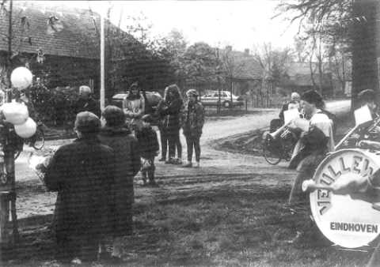
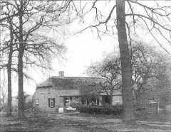

# Beschermd Dorpsgezicht Riel

##### (Verschenen in Nieuwsbrief Boerderijenstichting Noord-Brabant, 28 juni 1995)

**Op Zaterdag 22 april was het feest op het gehucht Riel, omdat de laatste boom van de eerste fase van het groenplan met ceremonieel vertoon de grond in ging.**

 
_Planten laatste eik, beschermd dorpsgezicht Riel_

Landschapsarchitect Stan Elings van onze Boerderijenstichting is de stuwende kracht geweest bij de totstandkoming van het groenplan, in opdracht van de dienst Stadsontwikkeling van de gemeente Eindhoven.

In een goede en vrij unieke samenwerking tussen gemeente, bewoners en de Boerderijensctichting bleken de mensen van Riel bereid hun privé-belangen aan de kant te zetten en hun tuinen opnieuw in te willen richten ten gunste van het algemeen belang.
Ook wordt er nog gewerkt aan een nieuw bestemmingsplan voor Riel, waarbij ook onze stichting is betrokken.

Riel is vermoedelijk ontstaan in de 7e eeuw en maakte vele eeuwen lang deel uit van de gemeente Zesgehuchten (Riel, Hoog Geldrop, 't Hout, Hulst, Gijzenrooi, Genoenhuis), dat in 1921 werd samengevoegd met Geldrop.
Gerechtelijk was het lange tijd onderdeel van de Heerlijkeheid Heeze-Zesgehuchten.
In 1972 werd Riel geannexeerd door Eindhoven, dat in 1975 besloot de minister van CRM te vragen Riel aan te wijzen als Beschermd Dorpsgezicht.
In de staatscourant van 9 oktober 1991 verscheen de offici&euml;le afkondiging.

Het gebied is 41 ha groot en ligt op de grens van Eindhoven en Geldrop en omvat 17 boerderijen en nog enige "arbeidershuisjes". 
De huidige bebouwing stamt grotendeels uit het einde van de vorige eeuw en geeft nog een middeleeuwse vorm aan het gehucht.
De oudste bebouwing lag in het zuidelijke deel van Riel op een dekzandrug "de Donk", waarlangs een beekje "de Lakerloop" stroomde, dat nu nog in het landschap als een slootje is terug te vinden.
Nabij de lakerloop werd aan het einde van de 15e eeuw een kapel gebouwd, gewijd aan Antonius Abt.
In 1512 werd de kapel waarschijnlijk verwoest door de Gelderse troepen, in 1520 weer opgebouwd en in 1648 "in beslag genomen" door de Protestanten.

 
_boerderij Riel_

Volgend jaar hoopt men weer feest te kunnen vieren op Riel, als de schop bij de boerderij van Jan van Rooy (rijksmonument) weer zal zijn herrezen.
De boerderijenstichting (Louis de Kok) heeft het ontwerp gemaakt.

Ook zijn de bewoners van Riel van plan in eigen beheer de kapel weer in ere te herstellen, die zou voor het einde van deze eeuw klaar moeten zijn.
U zult daart ongetwijfeld meer over horen.
