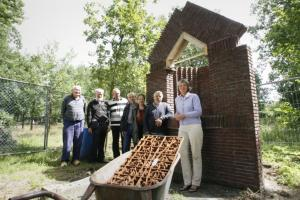

# Maria van Zeven Smarten terug in Riel

##### door onze correspondent Geert van Elten (Verschenen in Eindhovens Dagblad, donderdag 24 juli 2008)

**EINDHOVEN - Een bedevaartsoord zal Riel niet snel worden.**

 
_Vanaf links: Jan van Rooijen, Gerrit Nolde, Wilbert Gooskens, André de Bock, Adriana van Brunschot, Cor Leemeijer en Titia Droog bij het Mariakapelletje in aanbouw.
(Foto Kees Martens)_

Maria is er immers nooit verschenen, iets wat Lourdes en Fatima wel wordt toegeschreven. Maar het buurtschap op de grens van Stratum en Geldrop is zeker zo mooi en krijgt toch ook zijn eigen Mariakapelletje. Het bescheiden onderdak voor de Moeder Gods is al in aanbouw aan het begin van de straat Riel, nabij de Rielsedijk en wordt 13 september gewijd door Paul Vincent, pastoor van de parochie Stratum.

Het kapelletje was jarenlang een wens van de bewoners van Riel. Voordat het buurtschap tien jaar geleden de status van beschermd dorpsgezicht kreeg, hebben zij samen met ambtenaren van de gemeente Eindhoven vastgesteld wat kenmerkend was voor het karakter.

"We hebben veel historie van het gebied achterhaald", vertelt Titia Droog, die met een aantal buurtgenoten aan haar keukentafel zit. "Helemaal duidelijk wordt het niet, want de verschillende bronnen spreken elkaar soms tegen. Maar een mysterie is ook mooi."

Adriana van Brunschot woont op Riel, een eind voorbij de plaats waar nu gebouwd wordt. "Vlak bij mijn huis heeft in de zeventiende eeuw een grote kapel gestaan met maar liefst drie altaren, dat was een logeerplaats voor paters Augustijnen", weet ze. "En er zou ooit ergens een kapel van Maria hebben gestaan, maar niemand weet waar."

Iedereen vond dat een kapel ook nu hoort bij Riel. Een paar jaar nadat de status van beschermd dorpsgezicht was verleend, moest het er maar eens van komen. Een aantal Rielenaren heeft toen een rondje Brabant gemaakt om authentieke kapelletjes te fotograferen, bedoeld om architect André de Bock te inspireren. "Maar ik wilde niets kopiëren", zegt die. Hij snapte wel dat het niet te groot moest worden, want Riel zit niet te wachten op een hol voor hangjongeren. Ook moest het recht doen aan de twee naastgelegen monumentale boerderijen.

Inmiddels zijn de contouren van het bouwwerk al te herkennen. Opgetrokken in kleine roodbruine baksteen, een meter of vijf van het wegdek, wordt het een kleine nis, die plaats zal bieden aan het doopvont dat naar verluidt stamt uit de kapel van de Augustijnen en een tegeltableau met de afbeelding van Maria.

Het is de Maria van de eeuwig durende bijstand, zoals blijkt uit het Byzantijnse opschrift. De vader van de architect had het cadeau gekregen van bisschop Lemmens uit Roermond.

Toch zal het kapelletje worden vernoemd naar Maria van de Zeven Smarten, naar het vermeende voorbeeld uit Riel. "Bovendien komen mensen eerder voor smart dan voor bijstand", verwacht Titia Droog.

Die bezoekers kunnen een kaarsje plaatsen tussen het verroeste ijzer door van het speciaal bij een Astens antiekwinkeltje op de kop getikt hekwerk. Gerrit Nolde, ooit tuinier in Riel en nu correspondent en fotograaf voor het buurtblad, zal en rolstoeltoegankelijk pad aanleggen.
