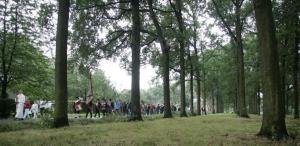

# Heilige Maagd, wees gegroet in Riel

##### door onze correspondent Geert van Elten (Verschenen in Eindhovens Dagblad, dinsdag 16 september 2008)

 
_De nieuwe Mariakapel op Riel werd zondag ingewijd. In processie trok het gezelschap door het buurtschap.
(Foto Irene Wouters)_

**EINDHOVEN - Het mag misschien geen wonder heten, maar Maria van de zeven smarten heeft onmiskenbaar de bewoners van het Eindhovense buurtschap Riel dichter bij elkaar gebracht.**

Na tien jaar wensen, dromen, plannen maken, tekenen, vergunningen aanvragen en metselen, heeft de Heilige Maagd officieel haar plaats ingenomen in de nieuwe kapel op de hoek van Riel en de Rielsedijk.

Precies 150 jaar nadat zij in Lourdes aan Bernadette Soubirous verscheen, kreeg het kleine onderkomen zondag de zegen van pater Paul Ravi Iruthayasamy, pastoor van de parochie Stratum.

De plechtigheid was begonnen met een heuse processie door het buurtschap én – na de ruimhartige regenbuien van die ochtend – door de modder. Voorafgegaan door de diaken en het gilde van St. Catharina en St. Barbara uit Geldrop, schreed de pastoor in zijn al snel niet meer smetteloze gewaad voor zijn gevolg uit. Halverwege, waar twee blauwe linten aan een boom de historische plaats van de eerste, veel grotere kapel markeerden, had het Gregoriaans koor Pius X nog het Ave Maria gezongen.

Even na één uur arriveerde de kleine optocht bij het nieuwe kapelletje. Het vroeger altijd zo snel afgeraffelde Wees Gegroet Maria klonk nu verrassend op zijn plaats als een oprecht welkom. De bitterzoete wierrook, het nog steeds bijzondere accent van pater Paul en de Gregoriaanse gezangen van het koor onder de ruisende bomen van Riel maakten er een wonderlijk geheel van.

Daarna spraken zeven inwoners van Riel en andere betrokkenen ieder een kort gebed om de zeven smarten te duiden, die Maria vanwege haar veelbesproken zoon heeft moeten doorstaan.

Na de plechtigheid bleef iedereen, voor koffie, een krentenbol en een borreltje. En om weer bij te praten, want de bouw heeft bij veel bewoners en andere bekenden oude verhalen losgemaakt over Riel. Die verhalen en alles over de nieuwe kapel zijn terug te vinden in het binnenkort te verschijnen boekje 'Riel, het kleinste dorp van Eindhoven'.
