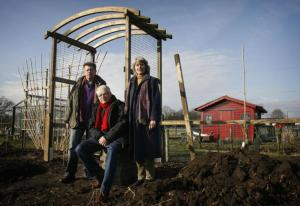

#  Volktuinders Stratum op schone toer

##### door onze correspondent Geert van Elten (Verschenen in Eindhovens Dagblad, dinsdag 10 februari 2009)

 
_Het bestuur van de volkstuinvereniging: (vlnr) Bertus Mecklenfeld, Bert Beks en Bertie van den Boogaard.
(Foto Irene Wouters)_

**EINDHOVEN - De Volkstuinvereniging Stratum wordt een stuk ecologischer. Tenminste, dat wil het bestuur. Met het binnenhalen van Bertie van den Boogaard als nieuwe voorzitter heeft de vereniging meteen een hoop kennis in huis over duurzaam tuinieren. Secretaris Bertus Mecklenfeld en penningmeester Bert Beks zijn daar erg blij mee, maar ook met het feit dat nu een vrouw de voorzittershamer in handen heeft.**

"We willen dat het bestuur een afspiegeling is van het ledenbestand" , zegt de secretaris. "Dus moest er een Turk of een vrouw in komen." Beks grapt: "Nu zijn we de drie B's: Bertus, Bertie en Bert."

Mecklenfeld is blij met een voorzitter die kennis van zaken heeft. "We krijgen bijvoorbeeld paardenmest van de buren. Kijk maar om je heen: overal staan paarden in de wei. Dankzij Bertie weten we nu dat mest met stro goed is, maar dat mest met houtvezels de groenten juist kapotmaakt."

Die kennis is Bertie van den Boogaard overigens niet komen aanwaaien: ze heeft zich bekwaamd als docent ecologische siertuin en is nu bezig met een gelijksoortige opleiding voor de moestuin.

De voorzittersvacature ontstond door het vertrek van Huib van Loon, die na meer dan dertig jaar de schop niet meer in de aarde wilde steken. Hij stond aan de wieg van de vereniging, na het faillissement van Daf ontstaan door het samengaan van Daf Tuin en Onze Hof.

Bertie van den Boogaard meldde zich twee jaar geleden aan de Brakenstraat tussen Rielsedijk en Geldropseweg, nadat ze vernomen had dat haar moestuin aan de Van Renesseweg zwaar vervuild was. " Daar zat ik opeens met mijn goede bedoelingen van gezond tuinieren", vertelt ze in de kantine van de vereniging. "Voordat ik lid werd, heb ik me ervan verzekerd dat het hier wel schoon was."

Behalve kennis heeft ze bestuurlijke ervaring: ze zit ook in het bestuur van de Vereniging voor Ecologische Leef- en Teeltwijze (Velt), waar ze zich bekommert om een hoogstamfruitboomgaard, wat met haar achternaam nauwelijks een verrassing is.

Het vernieuwde bestuur heeft behalve de ecologische ambitie ook het voornemen om de leden meer bij het reilen en zeilen van de club te betrekken. "Wij willen dat iedereen invloed kan hebben op de beslissingen die wij nemen", legt Beks uit.

De andere bestuursleden geven aan dat ook vaker een beroep op de leden gedaan zal worden. Voor een klusje in het algemeen belang, zoals het repareren van het hekwerk of de keukenkastjes, of voor het schoonhouden van de tuinen.
