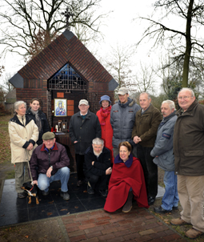

# Mariakapel Riel bindt

###### (Verschenen in Groot Eindhoven, woensdag 11 februari 2009)

 
_Bewoners en leden van buurtvereniging Riel (met blauwe hoed en rode jas is Titia Droog) en begeleiding en deelnemers van zorgboerderij 'Stal de Groof' die dagelijks voor het onderhoud van de kapel zorgen._

**“De kapel is door onze buurtschap gebouwd. Het heeft ons samengebracht en het buurtgevoel gestimuleerd. Na de bouw van de kapel is dat gevoel er nog steeds. Het is onze kapel en wij zijn er als buurt verantwoordelijk voor. Zo voelen wij dat. Het is de rode draad van Riel”, vertelt een enthousiaste Titia Droog van buurtvereniging Riel.**

“Enkele jaren geleden heeft de gemeente het bestemmingsplan Riel vastgesteld. Er stond een alinea in over het terugplaatsen van een kapel”, legt Droog uit. In de 15e eeuw stond er in Riel al een kapel. Door de eeuwen heen zijn er verschillende geweest. “Wij hebben elk jaar een opschoondag en elk jaar ging het over de kapel. Op een gegeven moment hebben we gezegd: ‘We gaan eraan beginnen. We zijn gaan kijken in de regio naar kapellen, hebben met de gemeente gepraat over de mogelijkheden en de armen uit de mouwen gestoken.”

## Mix

De buurt is heel gemêleerd. Bewoners met van vroeger uit met een agrarische achtergrond maar ook ‘stadsyuppen’ die gekozen hebben voor het buitengebied. Droog: “Die mix werkte prima. Iedereen pakte meteen aan of wist mensen te vinden, die konden helpen. Meestal belangeloos. We hebben zelf de kapel gebouwd en houden de kapel zelf bij en ze staat op een punt dat de buurt alles goed in de gaten kan houden.”

## Trekpleister

De kapel was vanaf het begin een trekpleister. Dagelijks bezoeken mensen de kapel om rust te vinden voor overpeinzingen, troost of gebed. Droog: “Onvoorstelbaar. Hoeveel mensen afkomen op de kapel. Het is nu koud weer maar toch nemen mensen de moeite om even naar de kapel te komen.”  De buurtschap bekijkt met gepaste trots het bezoek aan de kapel. “Fijn dat de Mariakapel veel voor Riel betekent, maar ook voor anderen!”
  
