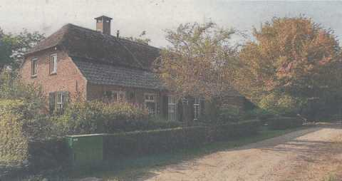

# Bosgordel bij beschermd dorpsgezicht Riel blijft

##### Verschenen in Zondags Nieuws, zondag 22 augustus 2010

 
_Rijksmonument in Riel. foto: Mark Bergsma_

**Eindhoven - De bosgordel bij Riel die het beschermd dorpsgezicht afscheidt van de nieuwbouwwijk Gijzenrooi/Putten blijft.
Wel wordt er de komende jaren kleinschalig en verdeeld over de jaren onderhoud uitgevoerd, onder meer door het afzetten van beplanting.**

Dit is de uitkomst van de succesvolle bemiddeling tussen de gemeente, buurtvereniging Riel en andere betrokkenen.
Op basis van dit goede resultaat van de bemiddeling heeft het college van burgemeester en wethouders besloten in te stemmen met het nieuwe beheer van de bosgordel Riel.

De nieuwe beheersaanpak van de bosgordel richt zich op het zo goed mogelijk in stand houden van de visuele afscherming door een duurzaam beheersbare bosgordel met daarin wandelpaadjes voor omwonenden.
Afgesproken is dat de bosgordel moet worden gezien als een koepel met twee bosmantels.
Nooit mag er op twee parallelle plaatsen tegelijk worden gedund.
Gekozen wordt voor een asymetrische aanpak.

Trefpunt Groen Eindhoven heeft als bemiddelaar opgetreden.
