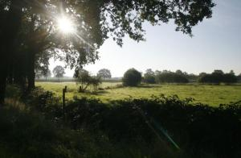

# Oude landschap keert terug in Gijzenrooi

##### (Verschenen in het Eindhovens Dagblad, 23 september 2010, door Simon Rood)

**Geldrop – Gijzenrooi gaat terug in de tijd. Het landelijke gebied tussen Eindhoven en Geldrop wordt heringericht, waarmee het landschap van rond 1900 deels in ere wordt hersteld.**

 
_Het landschap in Gijzenrooi wordt deels weer zoals het rond 1900 was
(foto: Irene Wouters)_

Door de aanplant van bomenrijen, houtwallen en heggen keert de kleinschalige verdeling van land terug, zoals dat tot eind negentiende eeuw gebruikelijk was in agrarisch gebied. De herinrichting betreft zo’n honderdvijftig hectare rondom het vroegere gehucht Gijzenrooi, nabij kampeerboerderij Het Uilenest.

De nieuwe aanplant biedt een fraai landschap voor wandelaars en fietsers, maar moet ook meer dieren gaan trekken. Vooral vogels en kleine zoogdieren voelen zich op hun gemak in beschut gebied. De houtwallen, bestaand euit hazelaars, sleedoorns en wilgen, zijn populair nestgebied van struweelvogels als de zwartkop en de tuinfluiter. Ook verwacht de gemeente Geldrop-Mierlo, waar Gijzenrooi onder valt, dat het aantal fazanten en patrijzen toe gaat nemen. Een poel ten zuiden van Gijzenrooi kikkers trekken. Dit najaar begint de gemeente met de aanplant. Zij trekt er 70.000 euro voor uit. Het project geldt ook als compensatie voor het verlies van groen in de nieuwe woonwijken Luchen en Loeswijk in Mierlo. Over twee tot drie jaar moet het landschap weer ogen als rond de vorige eeuwwisseling. Plekken waar nu nog snelweg A67 te zien is, zijn dan dichtgegroeid.

> ### Gijzenrooi
> - Gijzenrooi ligt ten westen van Geldrop in een groen gebied dat grenst aan Eindhoven, waar ook beschermd dorpsgezicht Riel en het moerasachtige natuurreservaat Gijzenrooise Zegge liggen.
> - Eind jaren zestig bestonden plannen het gebied vol te bouwen.
> - Na protesten van beide gemeenten werd het een groene bufferzone  om verdere verstedelijking tegen te gaan.
> - In de jaren negentig maakte Het Brabants Landschap de eerste planen om Gijzenrooi en omgeving ecologisch duurzaam in te richten en het waterpeil te verhogen.
> - Van oudsher kende het gebied veel agrarische activiteit, waarvan de geschiedenis teruggaat tot de vroegere middeleeuwen.
> - De kippenhouderij van Van Lith is nu de enig overgebleven (pluim-) veehouder. Pogingen hem te verplaatsen zijn niet gelukt.

Om het groene gebied nog aantrekkelijker te maken voor nieuwe flora en fauna, krijgt ook de Kleine Beekloop ook een ‘opknapbeurt’. Het zijstroompje van de Kleine Dommel loopt van zuid naar noord door het gebied en oogt nu als een machinaal getrokken sloot in rechte lijnen. Door de bedding ondieper te maken, te verbreden en een overloop gebied ernaast aan te leggen, wordt het een trekpleister voor tal van amfibi&euml;n en andere waterliefhebbers als libellen. Het water staat via een tunnel onder de A67 in verbinding met de Groote Heide. Langs het stroompje komt een wandelpad. Voor de aanpak van de Kleine Beekloop wacht de gemeente nog op provinciale subsidie. De klus staat gepland voor 2011 of 2012.

Mogelijk vestigt zich op termijn ook een ecologische boer in Gijzenrooi. De gemeente is met de provincie nog in overleg hiervoor. Volgens wethouder Wim Vissers (PvdA) zijn er ‘gegadigden’. Een ‘ecoboer’ zou met bijvoorbeeld runderen het gebied op natuurlijke wijze kunnen onderhouden, door begrazing en bemesting. Ook denkt Vissers aan verkoop van ecologische boerenproducten, zoals de Genneper Hoeve in Eindhoven dat ook al doet.
