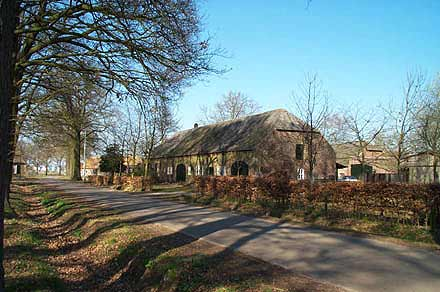

# Welkom op Riel

Als een groene oase ligt het gehucht Riel onder de rook van Eindhoven. Waren er vroeger plannen om Riel aan de stadsuitbreidingen van zijn grote buur op te offeren, nu is gelukkig vastgesteld dat deze lieflijke nederzetting, met zijn deels onverharde wegen, fraaie struwelen en karakteristieke boerderijen, als [beschermd dorpsgezicht](monument) bewaard moet blijven.

Riel is een typisch Brabants esdorp. De dorpen zijn hier niet, zoals in Drente, concentrisch van vorm, maar langgerekt. Deze z.g. kransakkerdorpen breidden zich uit naarmate de beschikbare bouwgrond rondom de akkers vol raakte. Nieuwe vestigingen vonden dan wat verderop aan de kronkelige weg rondom de akkers plaats. Dit nederzettingspatroon is in Riel goed bewaard gebleven. Een bijzonderheid is, dat de eerste ontginningsactiviteiten hier al in de 7e eeuw moeten hebben plaatsgevonden. De blokvormige verkaveling, waarbij akkers door hagen en houtwallen omringt werden om het vee te weren, is in Riel nog steeds te herkennen. In de eeuwen vóór het gebruik van kunstmest werden de akkers vruchtbaarder gemaakt door er zoden op te leggen die met dierlijke mest waren vermengd. Dit verklaart het holle, hoge karakter van de oude akkers.

In de 12e eeuw kwam er in Riel een opleving in de ontginning van de woeste gronden, doordat een kerkelijke instelling zich hierop toelegde. Later, toen Brabant door de Staten-Generaal tot Generaliteitsland was verklaard en als een wingewest werd uitgebuit, hadden de boeren weinig reden en mogelijkheden om hun arsenaal uit te breiden. De meeste boerderijen ter plaatse dateren uit het einde van de 19e eeuw, omdat bij een grote brand in 1877 vele hoeven verloren gingen.
