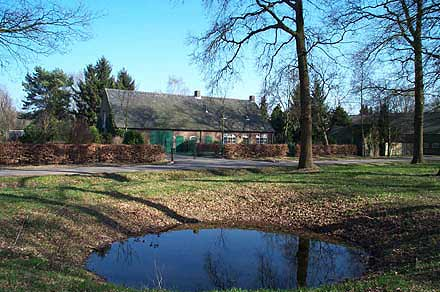
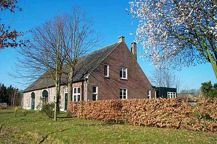

##### Bestemmingsplan "Beschermd Dorpsgezicht Riel 1998"

## Beschrijving van de bebouwing

### Riel 1
Deze boerderij werd in 1877 slachtoffer van een brand, samen met een daarnaast gelegen, niet herbouwde woning.
In 1924 werd de boerderij wederom door brand getroffen.
De boerderij werd na de brand verhoogd.
Desondanks heeft de boerderij haar Brabantse karakter behouden en dateert de huidige boerderij grotendeels uit 1977.
Ze behoort tot het langgeveltype.
Ze is uitgevoerd in baksteen en heeft een zadeldak, dat is gedekt met antracietkleurige sneldakpannen.
In de kopgevel bevinden zich vlechtingen en onder de dakvoet bevindt zich een muizetand. 

Om de aanliggende plaatse in zijn oorspronkelijke vorm te herstellen zal het noodzakelijk zijn de zich hierop bevindende bebouwing te verwijderen, behoudens de hoofdmassa van de tegenoverliggende schuur.
Teneinde de bouwmasse van de boerderij op het erf beter tot zijn recht te laten komen, is het gewenst de bijgebouwen zodanig te situeren, dat deze de clustervorming op het erf versterken.

De boerderij is van belang voor het beschermd dorpsgezicht en dient gehandhaafd te blijven.

### Riel 2
Deze boerderij dateert uit 1876. Dit is vast te stellen aan de jaarankers die tegen de zijgevel zijn aangebracht. De boerderij is enkele keren verbouwd.

  
*Riel 2 (Foto: Yvonne Henderson)*

Ook hier is sprake van een langgeveltype. Ze heeft een zadeldak met wolfseinden, gedekt met blauwe verbeterde hollandse pannen op het woonhuis en blauwe oudhollandse pannen op stal en schuurgedeelte.
De gevel heeft lelijke vernieuwde zesruits ramen in het woonhuis.
De dakvoet is voorzien van siermetselwerk. De boerderij heeft twee schuur- en staldeuren met korfbogen.
Daartussen bevindt zich een dichtgemetselde deur met een sementboog. Achter de boerderij bevindt zich een schuur met zadeldak en wolfseinden, gedekt met blauwe oudhollandse pannen. 

Zowel schuur als boerderij staan op de rijksmonumentenlijst. Beide dienen gehandhaafd te worden met uitzondering van de aanbouw aan de schuur.
De overige bebouwing op het erf past daar niet bij en dient geloopt te worden.

### Riel 3
Ook dit is een langgevelboerderij met een zadeldak, gedekt met blauwe muldenpannen. 

  
*Riels 3 (Foto: Yvonne Henderson)*

De boerderij dient gehandhaafd te blijven. Om de massavorm van de boerderij te versterken zal het noodzakelijk zijn het aanbouwsel aan de achterzijde te verwijderen.
De aanbouwen aan de achterzijde dienen evenals de vrijstaande bijgebouwen verwijderd te worden.
Als de authentieke raamindeling van het woongedeelte terug gebracht zou worden, komt dit ten goede aan de architectonische kwaliteit van het pand.

### Riel 4
Op deze plaats stond vroeger een oude boerderij, die verbouwd is tot schuur waaraan een modern huis met verdieping is toegevoegd Het nieuwe woonhuis heeft een zadeldak met blauwe verbeterde hollandse pannen en past geheel niet in het dorpsbeeld. De aangrenzende bakstemen schuur heeft een zadeldak gedekt met blauwe mulderpannen. 
De schuur en bijgebouw kunnen gehandhaafd blijven en zijn met enige aanpassingen beeldondersteunend.

### Riel 5
De boerderij is van het langgeveltype en heeft een zadeldak met blauwe pannen (tuile de nord).
Het woongedeelte vanaf de voordeur is in de 20er-30er jaren aangebouwd in de stijl van die periode.

  
*Riel 5 (Foto: Yvonne Henderson)*

Het saaie ritme van de voorgevel zou doorbroken moeten worden, waardoor de architectonische vormgeving sterker wordt enz.
Het gemetselde bakhuisje is met tuille de nord pannen gedekt en moet gehandhaafd blijven. Ook de boerderij dient gehandhaafd te blijven. Om de functie van het erf te versterken zal het noodzakelijk zijn de overige bebouwing te verwijderen en eventueel te vervangen door beter aan de situatie aangepaste bebouwing.

  
*Het bakhuis bij Riel 5 (Foto: Yvonne Henderson)*

### Riel 7
Deze boerderij is gebouwd op de fundamenten van het vroegere speelhuis (jachthuis) van Riel.
De moderne boerderij die na de brand van 1945 werd gebouwd is niet storend in de omgeving van de andere boerderijen in Riel.
Historisch erg belangrijk is het deel van de gracht dat nog overgebleven is. Ook de heg langs de gracht is een onmiskenbaar element in het gehucht Riel.
De boerderij is van het langgeveltype en heeft een zadeldak met wolfseinden, gedekt met rode mulderpannen. De ramen met segmentbogen er boven getuigen van de herbouw van de boerderij na 1945.

  
*Riel 7 (Foto: Yvonne Henderson)*

Om de hoofdvorm van de boerderij te versterken is het zeer gewenst de achter aanbouw te verwijderen.
De boerderij dient gehandhaafd te blijven, evenals het bijgebouw.

### Riel 8
Deze boerderij ligt vrijwel op de plaats van een oudere boerderij. De huidige boerderij werd in 1881 gebouwd. Ze is goed bewaard gebleven, zij het dat het dak aan de voor- en achterzijde werd voorzien van een dakkapel. Ook hier is sprake van een langgevelboerderij met zadeldak en wolfseinden. Het dak is met riet gedekt, en de dakvoet is met blauwe oud-hollands pannen gedekt.
De bakstenen stal aan de weg is eveneens voorzien van een nieuw rieten zadeldak met wolfseinden en een met blauwe oud-hollands pannen gedekte dakvoet. De raamkozijnen van het woonhuis hebben een 6-ruits indeling met luiken. 

Ter versterking van de massavorm van de boerderij is het noodzakelijk de aanbouw aan de achterzijde (beginnend vanuit het rieten dak) aan te passen. Om het cluster situatief te versterken, verdient het aanbeveling de overige bebouwing te verwijderen en te vervangen door een aan deze situatie aangepaste, architectonische verantwoorde bebouwing. De boerderij, de stal aan de weg, de hooischuur en het bakhuis dienen gehandhaafd te blijven.
De boerderij is voorgedragen als rijksmonument.

---
Beschreven bebouwing
* [Riel 1 - 8](riel1-8)
* [Riel 9 - 14](riel9-14)
* [Rielsedijk 20 - 49](rielsedijk)

