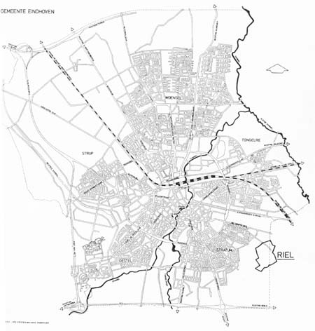
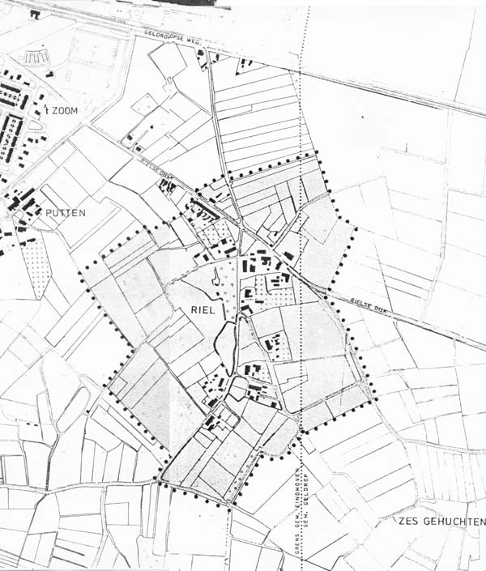
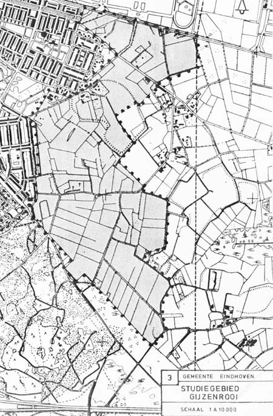

##### Riel - een Kempisch gehucht

## 1 Inleiding
### 1.1 Planologische voorgeschiedenis

Het gehucht Riel ligt op de grens van de gemeenten Eindhoven en Geldrop ten zuiden van de Geldropse-/Eindhovenseweg (zie kaart nr.1).

  
*Kaart 1: Lokatie van Riel*

Het studiegebied (zie kaart nr.2) is 40,9 hectaren groot, waarvan 7,5 hectaren op het grondgebied van de gemeente Geldrop zijn gelegen. Vóór de grenswijziging van 1972 lag Riel in zijn geheel op Geldrops grondgebied.

  
*Kaart 2: Het studiegebied Riel*

In 1951 werd door de gemeente Geldrop het plan in hoofdzaak vastgesteld en in 1953 het Uitbreidingsplan Eindhovense Grens.

Deze plannen zijn nog steeds rechtsgeldig, zij het dat volgens de Wet op de Ruimtelijke Ordening bestemmingsplannen iedere 10 jaar herzien dienen te worden. Aan Riel is in voornoemde plannen de bestemming “landelijk gebied” gegeven.

In 1968 heeft Geldrop in Overleg met Eindhoven een structuurplan voor het gebied Gijzenrooi vastgesteld. Hieropvolgend werd de uitwerking ter hand geneomen. In 1970 verscheen de uitwerking van het structuurplan bij de dienst ruimtelijke ordening en verkeer. Op grond hiervan kwam een globaal bestemmingsplan tot stand ten behoeve van met name woningbouw; ook in Riel. Inmiddels zijn ideeën over de wenselijkheid van nieuwe woningconcentraties in de zuid-oosthoek van Eindhoven en het opofferen van het Kempisch gehucht Riel, gewijzigd ten gunste van Riel. Op 29 september 1975 heeft de raad dan ook besloten “de minister van cultuur, recreatie en maatschappelijk werk” in overweging te geven het gehucht Riel aan te wijzen als beschermd dorpsgezicht.

### 1.2 Beleidskader diverse overheden

#### Rijk
In de nota Landelijke Gebieden (Beleidsvoornemens 1977) is van rijkswege tot uitdrukking gebracht, dat er gebieden met cultuurhistorische waarden zijn, die binnen een stedelijke invloedsfeer liggen en daarom bescherming nodig hebben.

In de Verstedelijkingsnota (regeringsbeslissing 1977) wordt voor Noord-Brabant de koers gezet op concentratie van verstedelijking in de stadsregio. Verdere verstedelijking moet zich naar de condities van het landschap richten.

#### Provincies.
In het streekplan voor Zuid-Oost-Brabant maakt Riel deel uit van een stadsregionale geledingszone. Dit is in principe een integratiezone van stedelijke en landschappelijke functies. Deze zone kan gebruikt worden voor recreatieve doeleinden, maar daarbij dienen geen recreatieve-objecten geprojecteerd te worden teneinde recreatief gebruik te beperken gezien de kwetsbaarheid van de natuur. Het gebied tussen Geldrop en Eindhoven (Gijzenrooi) waar Riel onderdeel van is, wordt in het streekplan aangeduid als agrarisch gebied met landschappelijke en/of culturele waarde. In dit gebied moet de landbouw, volgens het streekplan, goed kunnen blijven functioneren.

#### Agglomeraties
In het landschapsonderzoek van de agglomeratie Eindhoven wordt Riel genoemd als een beschermd dorpsgezicht in voorbereiding, gelegen in een cultuurhistorisch belangrijk landschap, namelijk het akkerlandschap. De volgende omschrijving daarvan wordt gegeven:

"Het akkerdorpenlandschap ontstond rondom de vroegste vestigingen. Een aantal boerderijen was zodanig gegroepeerd, dat de staldeuren gericht waren op een open ruimte, de plaatse, die gebruikt werd als verzamel- en drinkplaats voor vee.

De gehuchten Straten, Notel, de Vleut, Zandoerle, Leenderstrijp, Loon en Riel zijn hiervan typische voorbeelden. Dergelijke plaatsen waren in hoge mate bepalend voor de structuur van een dorp en het landschap er om heen. Deze nederzettingen waren gesticht op de flanken van de hoge ruggen tussen de verschillende beekdalen. De gronden rondom de nederzetting werden tot akkers ontgonnen, terwijl men de graasgrionden en hooilanden verderaf op de heidevelden en in de beekdalen had (beemden). In de loop van vele eeuwen zijn de van nature reeds hoger gelegen akkergronden geleidelijk met mest nog verder opgehoogd waarbij ze langzamerhand een duidelijk gewelfd oppervlak hebben gekregen. Het akkerdorpenlandschap vinden we nog min of meer terug rondom de gehuchten Loon, Riel en Zandoerle en in het gebied gelegen tussen Leende en de nederzettingen Heezerenbosch en Kerkhof.

In Brabant vond, in afwijking van het Drentse type (esdorpen) een ontwikkeling plaats tot kransakkerdorp. Deze nederzettingen waren niet meer concentrisch van vorm doch langgerekt. Ze ontstonden naarmate de beschikbare bouwgrond tussen de akkers vol raakte. Nieuw vestigingen vonden nu plaats rondom de akker op vrij korte afstand van elkaar langs kronkelige wegen die de hoge ruggen in het terrein volgden. Het mooiste voorbeeld van deze structuur vinden we nog terug bij het kransakkerdorp Notel – Helder – Snepseind – Bollen en Straten, ten noord-oosten van Oirschot gelegen.

In latere tijden is vanuit het akkerdorp het beekdallandschap ontstaan door ontginning van de natste delen. Toen de grondwaterspiegel was gedaald ging men zich op sommige plaatsen dichter bij de beek vestigen."

#### Gemeente Eindhoven
Op gemeentelijk niveau wordt Riel genoemd in het Eindhovense Beleidsplan 1980-1983. In het hoofdstuk Ruimtelijke ordening wordt in het onderdeel Natuur-/groengebieden Riel genoemd met de vermelding dat in aansluiting op de aanwijzing door het rijk tot beschermd dorpsgezicht de beschermende werking planologisch geregeld dient te worden. Onder het hoofdstuk Monumenten wordt er in het beleidsplan de aandacht op gevestigd, dat gebouwen en hun omgeving (zowel particuliere als gemeentelijke eigendommen) in Riel voor het predicaat monument in aanmerking zouden kunnen komen.

  
*Kaart 3: Het studiegebied Gijzerooi*

In 1978 is een ambtelijke werkgroep gestart met de ontwikkeling van Gijzenrooi, exclusief Riel (zie kaart 3). Aan deze werkgroep werden ten aanzien van Riel de volgende voorwaarden meegegeven.

1. Groenstrook  
In verband met de voorgenomen ontwikkeling van Gijzenrooi is een groenstrook nodig om Riel af te schermen van de (toekomstige) bebouwing. Deze groenstrook valt buiten de grens van het beschermde dorpsgezicht van Riel. De groenstrook zal alleen aan de west- en noordzijde behoeven te worden aangebracht.
Om voldoende afscherming te kunnen bieden zal de groenstrook een breedte moeten hebben die varieert van 50 tot 100 meter. Bij de ontsluitingswegen zal deze groenstrook het breedst moeten zijn. De bebouwing achter de groenstrook zou vanuit Riel niet zichtbaar mogen zijn bij een boomhoogte van circa 10 meter.
Bij voorkeur zal de groenstrook zo spoedig mogelijk aangelegd moeten worden.
In de groenstrook kunnen wandelpaden en rustplaatsen worden opgenomen.

2. Ontsluiting  
Het aantal toegangswegen voor autoverkeer dient niet meer te worden uitgebreid maar eerder te worden verminderd.
De sfeer langs de toegangswegen zal zoveel mogelijk aansluiting dienen te vinden op die van Riel (bijvoorbeeld zo weinig mogelijk bebouwing erlangs).
Ontsluiting van langzaam verkeer mag verbeterd worden.
De wegen dienen een landelijk karakter te hebben qua profiel en materiaal.

#### Gemeente Geldrop
De raad van de gemeente Geldrop heeft op 31 oktober 1978 een programma van eisen vastgesteld voor het toekomstige woongebied Gijzenrooi (zie kaart 4). In dit programma wordt gesteld, dat door de “aangegeven begrenzing van het plangebied het cultuurlhistorisch belangrijke gehucht Riel veilig kan worden gesteld”. Tevens werd door de raad besloten te streven naar een aansluiting van de Gijzenrooiseweg op de Eindhovenseweg ter hoogte van de gemeentegrens Eindhoven/Geldrop. De gemeente Eindhoven zal er bij de gemeente Geldrop op aan moeten dringen er op toe te zien, dat hierdoor het gezicht op Riel niet verloren zal gaan en dat met name de Gijzenrooiseweg niet te dicht tegen Riel komt te liggen. De geplande kruising ervan met de Rielsedijk kan het karakter van de Rielsedijk aantasten.

Ongeveer aansluitend ten westen van het eiken-/beukenlaantje tussen Rielsedijk en Eindhovenseweg is een centrum voor 15 woonwagens geprojecteerd. Een bestemmingsplan is inmiddels in procedure gebracht.

### 1.2 Probleemstelling
Het enige dat er op dit moment concreet op wijst dat Riel in aanmerking zou kunnen komen als beschermd dorpsgezicht is, dat een zestal boerderijen op de Rijksmonumentenlijst is geplaatst. Op advies van de gemeentelijke Monumentencommissie zijn burgemeester en wethouders in 1975 ertoe overgegaan om de minister van cultuur, recreatie en maatschappelijk werk in overweging te geven Riel aan te wijzen als beschermd dorpsgezicht.

In 1977 werd door burgemeester en wethouders de ambtelijke werkgroep Riel ingesteld om het bestemmingsplan Riel voor te bereiden. Ook de gemeente Geldrop neemt deel in deze werkgroep. De taken van deze werkgroep zijn:

verzamelen van gegevens (inventarisatie);
bepalen van de intrinsieke waarde (analyse);
formuleren van een actieprogramma (doelstellingen).
De procedure, die verder gevolgd dient te worden om de rijksaanwijzing beschermd dorpsgezicht te verkrijgen, en dus ook de rijksbijdrage, is vermeld in bijlage 1.

De bewoners van Riel werden op 18 december 1978 door de gemeente uitgenodigd voor een hearing. Op deze hearing werd toegezegd, dat de bewoners individueel door de gemeente benaderd zouden worden in de periode half februari 1979 tot en met april 1979. In die periode hebben vrijwel alle bewoners van Riel van de gelegenheid gebruik gemaakt hun ideeën over het beschermde dorpsgezicht naar voren te brengen en hun belangen toe te lichten (Zie bijlage 2).

---
#### Inhoud 'Riel - een Kempisch gehucht'
[Verantwoording](index)  
1\. Inleiding  
[2. Bebouwing en grondgebruik](2.bebouwing)  
[3. Natuur en landschap](3.natuur)  
[4. Verkeer](verkeer)  
[Samenvatting en conclusie](conclusie)  
[Bijlagen en bronnen](bijlagen)   
