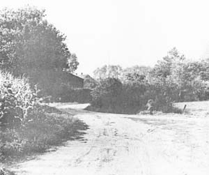
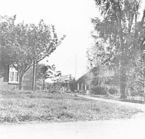
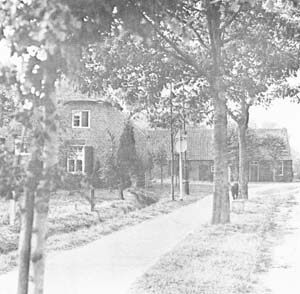
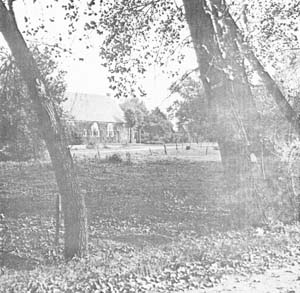
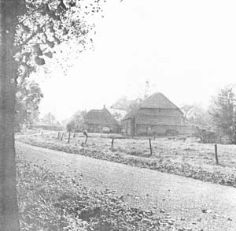
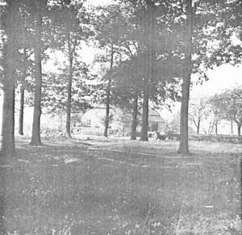
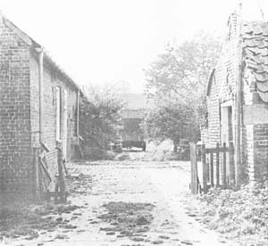
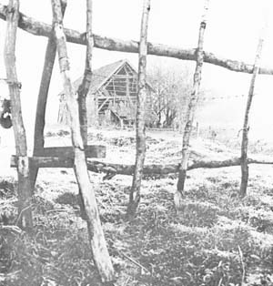

# Riel - een Kempisch gehucht
## 2 Bebouwing en grondgebruik
### 2.1 Stedebouwkundige ontwikkeling
*Dit hoofdstuk is gebaseerd op het rapport van G.Coenen*

Vanaf de 14 eeuw zijn er schriftelijke gegevens over het gehucht Riel. De oudste stukken spreken reeds over het bestaan van twee hoeven op Riel. Dit complex vormt waarschijnlijk het oudste gedeelte van het gehucht Riel. De beide hoeven lagen dicht bij elkaar. Desondanks gaat het om twee afzonderlijke gebouwen. Eén hoeve is tot in de 19e eeuw blijven bestaan. Bij deze hoeve ligt de zogenaamde weijer. Dit was een visvijver die behoorde bij de hoeve. Als zodanig is het nog bij enkele oude inworders van Riel bekend. Momenteel is dit nog enigsins zichtbaar in het landschap, hoewel de boeren de weijer aan het begin van de 20e eeuw hebben gedempt.

  
*Oostzijde Riel 8*

In 1485 werd er bij dit hoevencomplex, dat oorspronkelijk van de Tafel van de Heilige Geest uit ’s-Hertogenbosch was, een kapel gebouwd. Deze kapel was gewijd aan St.Antonius-abt. Zij werd bediend door priesters uit Geldrop die tot de Duitse Orde behoorden. Vanaf 1462 had de Duitse orde uit Gemert namelijk het patronaatsrecht over de parochie Geldrop. Ondanks het feit, dat Zesgehuchten een onderdeel was van de heerlijkheid Heeze – Leende – Zesgehuchten, werd dit gebied toch beschouwd tot de parochie Geldrop te behoren. De kapel van Riel was vrij groot, aangezien zij drie altaren bevatte. Geen zekerheid bestaat vooralsnog over de exacte plaats van de kapel. Coenen vermeldt, dat op grond van een kadastrale kaart van 1828 de situering op een perceel tegenover Riel 11 was. Vanuit die situering liep er een rechte weg naar de kerk van Geldrop.

Dit pad bestaat nog steeds. Volgens Kakebeeke ligt de kapel op de plaats waar voornoemde hoeve gelegen heeft. Ter hoogte van Riel 7 (zie kaart 7) lag het speelhuis van Riel. Vanaf de 17e eeuw komen we dit als zodanig tegen. Het speelhuis was een jachthuis van enkele Eindhovense kooplui. Rondom het speelhuis lag een gracht. Aan de voorzijde was een brug en via een trap kon men het gebouw binnengaan. Dit gebouw was het aanzienlijkste huis van Zesgehuchten. In de 19e eeuw stond het officieel te boek als slotje. Toen het gebouw in gebruik werd genomen als boerderij maakte het enkele veranderingen door met name in 1887. Na die tijd schijnt er weinig meer zichtbaar te zijn geweest van het oorspronkelijke gebouw, dat zelfs schilderingen bevatte. In 1945 brandde het gebouw af en momenteel staat er op deze plaats een moderne boerderij (Riel 7). Een groot deel van de oorspronkelijke gracht is gelukkig bewaard gebleven. Het oudste gedeelte van Riel (het hoevencomplex) was gelegen aan de Lakerloop. In de oude gegevens over het gehucht vinden we meestal gebouwen in de nabijheid van deze beek.

De verkaveling nabij de beek wijst op een hoge ouderdom. Riel bereikte aan het begin van de 18e eeuw haar grootste omvang met zo’n 35 huizen. Om en nabij het jaar 1800 waren er nog 29 huizen over. In 1832 waren er nog 24 huizen over. Momenteel ligt er op Riel geen enkele huis meer dat uit deze periode dateert. Van de 25 huizen in 1825 waren er vijf van leem. Acht huizen waren van slechte kwaliteit. Het speelhuis werd omschreven als een wel doortimmerd huis en de hoeve was het enige gebouw dat bekend stond als een welgebouwd huis. Verder waren er nog vier huizen waarvan de kwaliteit als redelijk bekend stond. Kortom de kwaliteit van de huizen die de eeuwen hadden doorstaan was vrij gering.

Tot in deze eeuw waren er lemen huizen op Riel, maar de vele branden op dit gehucht deden deze ook verdwijnen. Vele huizen werden echter gebouwd in dezelfde stijl en op de plaats van het vorige huis. Het gehucht Riel behield daardoor haar oude vorm, waardoor het nu zo’n grote waarde heeft voor de historie.

Op de oudst exact bekende situatie, die van de kadastrale opname van 1832 (zie kaarten 5 en 6) is het gehucht nog goed te analyseren. In het noorden was het oude dorpscentrum gelegen, die driehoekige plaatse, nog bezet met eikenbomen en voorzien van een dierenkuil c.q. brandkuil;. Rond de plaatse stonden vier boerderijen en enige landarbeidershuisjes. Op de plaatse kwamen wegen vanuit Geldrop (Hoog-Geldrop), Startum (Poeiers) en Urkhoven (Achterbosch) samen. Akkerwegen leidden naar de landbouwcomplexen, dreven leidden naar gemeenschappelijke heidegronden (Rielse Heide).

  
*Westzijde Riel 7 en 8*

### 2.2 Aard van de bebouwing
De in dit gehucht aanwezige boerderijengroep wijst op ontginngsactiviteiten uit de 7e eeuw. In hoofdstuk drie wordt daar dieper op ingegaan. De bebouwing ligt temidden van de hoogten, zogenaamde bolle akkers, ontstaan door het eeuwenlang opbrengen van mest. De huidige bebouwing is niet zo oud. Slechts één boerderij dateert van voor 1832. De overige boerderijen zijn van jongere datum.

De boerderijengroep in Riel is in goede staat bewaard gebleven in een structuur die meer dan 1200 jaar oud is. In Riel bevinden zich nu 17 boerderijen. Niet zo lang geleden zijn er nog twee boerderijen in Riel gesloopt. De een stond op de plaats van het vroegere Einzelhof tegenover Riel 5, de ander stond ten westen van en grenzend aan het eikenbos.

In het algemeen kan worden opgemerkt, dat de hierna te beschrijven en te handhaven bebouwing zo is gesitueerd, dat ze in samenhang met de wegenstructuur en de landschappelijke begroeiing mede bepalend zijn voor het visueel ruimtelijk aspect van Riel.

Ten aanzien van de opstallen, die om bedrijfstechnische redenen niet kunnen worden gemist, zal het in vele gevallen noodzakelijk/gewenst zijn, dat ze worden vervangen door bouwmassa’s, die qua situatie, massavorm, structuur en gevelindeling passen bij de te handhaven bebouwing, zodat de clustervorming in het algemeen en op het individuele erf in het bijzonder beter tot zijn recht komt. De realisering hiervan dient wel onder deskundige leiding plaats te vinden.

Verder is vermeldenswaard de aanwezigheid van enkele boerderijen op de Putten. Hoewel ze buiten de grens van het te beschermen dorpsgezicht vallen is handhaving ervan beeldondersteunend.

Beschouwt men de boerderijen op Riel afzonderlijk dan kan het volgende worden opgemerkt (zie ook kaart 7).

  
*Oostzijde Rielsedijk 21 en 23*

#### Riel 1

Deze boerderij werd in 1877 het slachtoffer van een brand samen met een daarnaast gelegen, niet herbouwde woning. In 1924 werd de boerderij wederom door brand getroffen. De boerderij werd na de brand verhoogd. Desondanks heeft de boerderij haar Brabantse karakter behouden en dateert de huidige boerderij grotendeels uit 1877. Ze behoort tot het zogenaamde langgeveltype. Ze is uitgevoerd in baksteen en heeft een zadeldak, dat gedekt is met blauwe sneldakpannen. In de kopgevel bevinden zich vlechtingen en onder de dakvoet bevindt zich een sierlijst. De boerderij heeft een regelmatige voorgevelindeling, waarvan de ramen van het woonhuis een empire-indeling hebben. De ramen zijn voorzien van luiken.

De boerderij is van belang voor het dorpsgezicht en dient gehandhaafd te blijven. Om de aanliggende plaatse in zijn oorspronkelijke vorm te herstellen zal het noodzakelijk zijn de zich hierop bevindende bebouwing te verwijderen. Teneinde de bouwmassa van de boerderij op het erf beter tot zijn recht te laten komen, is het gewenst de bijgebouwen zodanig te situeren, dat deze de clustervorming op het erf versterken.

#### Riel 2
Deze boerderij dateert uit 1876. Dit is vast te stellen aan de jaarankers die tegen de zijgevel zijn aangebracht. De boerderij is enkele keren licht verbouwd. Ook hier is sprake van een langgeveltype. Ze heeft een zadeldak met wolfseinden, gedekt met blauwe verbeterde hollandse pannen. De gevelindeling is regelmatig, met empire-ramen in het woonhuis. De luiken ontbreken. De dakvoet is voorzien van siermetselwerk. De boerderij heeft twee schuur- en staldeuren met korfbogen. Daartussen bevindt zich een later aangebrachte en vervolgens weer dichtgemetselde deur met segmentboog. Achter de boerderij bevindt zich een schuur met zadeldak en wolfseinden, gedekt met blauwe oud-hollandse pannen. Zowel schuur als boerderij staan op de rijksmonumentenlijst. Beide dienen gehandhaafd te worden met uitzondering van de aanbouw aan de schuur. De overige bebouwing op het erf past daar niet bij en dient te worden vervangen.

#### Riel 3
In de loop van de tijd is deze boerderij vaak verbouwd. De woning werd gebouwd op de fundamenten van een zeer oude boerderij; zij bevat enkele 18e eeuwse muurfragmenten. Ook dit is een langgevelboerderij met een zadeldak, gedekt met blauwe mulden pannen. Het verdient aanbeveling de ramen van het woonhuis aan te passen aan het boerderijtype. De boerderij dient gehandhaafd te worden. Om de massavorm van de boerderij te versterken zal het noodzakelijk zijn het aanbouwsel aan de achterzijde te verwijderen. Het kleine gebouwtje aan de achterzijde past door zijn vormgeving minder goed bij de architectonische redelijke kwaliteit van de boerderij.

#### Riel 4
Op deze plaats stond vroeger een oude boerderij, die verbouwd is tot schuur waaraan een modern huis met verdieping is toegevoegd Het woonhuis heeft een zadeldak met blauwe verbeterde hollandse pannen. De aangrenzende bakstenen schuur heeft een zadeldak gedekt met blauwe mulden pannan. Schuur en woonhuis kunnen gehandhaafd worden en zijn met enige aanpassingen beeldondersteunend. Het bijgebouw ten noorden van de schuur kan gehandhaafd worden, echter zonder aanbouwsel. Het gebouw ten oosten van de schuur is wat situatie betreft acceptabel. Massavorm, structuur en gevelindeling ervan zijn echter twijfelachtig.

  
*Westzijde Riel 5*

#### Riel 5

Samen met de aan de overkant van de weg gelegen boerderij vormde deze boerderij vroeger een hoeve, die in 1895 werd gebouwd op de plaats van de oude hoeve. De boerderij aan de overkant is inmiddels afgebroken. De overgebleven boerderij is van het langgeveltype en heeft een zadeldak met blauwe pannen (tuilles de nord). Ze heeft een gave bouwmassa en een regelmatige voorgevelindeling. Het woonhuis heeft een kruisraam. De boerderij dient gehandhaafd te worden. Om de functie van het erf te versterken zal het noodzakelijk zijn de overige bebouwing te verwijderen, en eventueel te vervangen door beter aan de situatie aangepaste bebouwing.

#### Riel 7
Deze boerderij is gebouwd op de fundamenten van het vroegere speelhuis (jachthuis) van Riel. De moderne boerderij die na de brand van 1945 werd gebouwd is niet storend in de omgeving van de andere boerderijen in Riel. Historisch erg belangrijk is het deel van de gracht dat nog overgebleven is. Ook de heg langs de gracht is een onmiskenbaar element in het gehucht Riel. Het is aan te bevelen de gracht in zijn oorspronkelijke vorm te herstellen.

De boerderij is van het langgeveltype en heeft een zadeldak met wolfseinden, gedekt met rode mulderpannen. De getoogde ramen getuigen van de herbouw van de boerderij na 1945. Boerderij en schuur dienen gehandhaafd te blijven. Om de hoofdvorm van de boerderij te versterken is het zeer gewenst de achteraanbouw te verwijderen. Een eventuele nieuwe aanbouw mag de hoofdvorm niet aantasten.

#### Riel 8
Deze boerderij ligt vrijwel op de plaats van een oudere boerderij. De huidige boerderij werd in 1881 gebouwd. Ze is goed bewaard gebleven, zij het dat het dak aan de voor- en achterzijde werd voorzien van een dakkapel. Het achterperceel wordt omgegevn door een beukenhaag. Ok hier is sprake van een langgevelboerderij met zadeldak en wolfseinden. De dakvoet is met blauwe oude Hollandse pannen gedekt. De bakstenen stal is eveneens voorzien van een nieuw rieten zadeldak, met wolfseinden en een met blauwe oud Hollandse pannen gedekt. Beiden hebben een regelmatige gevelstructuur. De ramen van het woonhuis hebben een empire-indeling met luiken. De boerderij, de stal aan de weg, de hoioischuur en het bakhuis dienen gehandhaafd te worden.

Ter versterking van de massavorm van de boerderij is het noodzakelijk de aanbouw aan de achterzijde (beginnend vanuit het rieten dak) aan te passen aan de dakvorm. Om het cluster situatief te versterken, verdient het aanbeveling de overige bebouwing te verwijderen en te vervangen door beter aan deze situatie aangepaste architectonische verantwoorde bebouwing.

#### Riel 9
Deze boerderij werd in 1901 herbouwd op de plaats van een oudere boerderij. In de voorgevel is de eerste steen ingemetseld. De boerderij is ingrijpend verbouwd. Ook hier is sprake van een langgevelboerderij. Ze heeft een zadeldak met rode mulden pannen. De gave bouwmassa is, ondanks de minder geslaagde detaillering van met name de zuidelijke kopgevel, beeldondersteunend voor de situatie ter plaatse Boerderij (eigenlijk woonhuis) en schuur handhaven.

Overige bebouwing op het erf is zowel situatief als qua massavorm niet te handhaven. Het karakter van de vervangende bebouwing zal uit beide oogpunten goed op het geheel moeten aansluiten.

#### Riel 10

De boerderij werd in 1879 herbouwd op de plaats van een oudere boerderij. Ze is nog vrij gaaf bewaard gebleven. Het is een langgevelboerderij met een zadeldak gedekt met blauwe pannen (tuilles du nord).. De gevelindeling is via verbouwingen aangepast aan het huidige gebruik. De stal is uitgebreid en de schuurfunctie is elders op het erf ondergebracht. Boerderij en schuur dienen gehandhaafd te worden. De achteraanbouw van de boerderij benadeelt in sterke mate de hoofdvorm. De totale kwaliteit van het erf zou versterkt worden door de diverse bijgebouwen te vervangen door een gecombineerd goed gesitueerd en architectonisch verantwoord bijgebouw.

  
*Noordzijde Riel 11*

#### Riel 11
Dit is één van de gaafste boerderijen in Riel. Dit geldt ook voor het interieur. De boerderij werd in 1865/66 gebouwd op een weiland langs de Lakerloop. Het is een langgevelboerderij met authentieke voorgevelindeling. Ze heeft een bakstenen bouwmassa met zadeldak en wolfseinden gedekt met stro en riet. De dakvoet is gedekt met oud Hollandse pannen. De woonhuisramen hebben 20 ruits schuiframen met luiken. Aan de straatzijde staat een bakstenen schop (dit is een opslag voor turf en gereedschappen) met schilddak en wolfseind gedekt met stro en blauwe oud Hollandse pannen.

Boerderij en schop staan op de rijksmonumentenlijst. Zij dienen gehandhaafd te worden. De gestrooide overige bebouwing zal samengevoegd moeten worden tot een geheel in relatie met de gebouwen op het naastgelegen erf teneinde een verantwoorde situatie te verkrijgen.

#### Riel 12
Tussen Riel 11 en Riel 13 stond vroeger een boerderij. De huidige bebouwing past niet in dit agrarisch geheel en zal daarom te zijner tijd verwijderd moeten worden. Deze gebouwen zijn momenteel bewoond.

#### Riel 13
Deze boerderij is in 1882 gebouwd. Op deze plaats lag voor die tijd geen boerderij. Ze is gaaf gerestaureerd. Ze heeft een zadeldak met wolfseinden, gedekt met riet en blauwe oud Hollandse pannen. De woonhuisramen hebben een empire-indeling met luiken. Deze boerderij staat op de rijksmonumentenlijst en dient gehandhaafd te worden. Daar de vormgeving van het tuinhuis afbreuk doet aan het geheel zal dit moeten worden verwijderd.

#### Riel 14
Deze boerderij is gelegen op de plaats van een zeer oude, mogelijk 17e eeuwse boerderij. De huidige boerderij werd tegelijk met Riel 1 in 1877 door brand verwoest.
Ze werd in de oorspronkelijke stijl herbouwd, zodat zij momenteel eigenlijk één van de oudste boerderijen van Riel is. Interessant bij deze boerderij zijn verder het bakhuis en het houten schop. Binnen in de “goei kamer”is nog een oude schouw aanwezig. De boederrij is zowel van buiten als van binnen nog vrij gaaf. Ze behoort tot het langgeveltype en is gedekt met riet en blauwe oud Hollands pannen. Ze heeft een zadeldak met wolfseinden. De gevelindeling is authentiek en heeft 20-ruits schuiframen in het woonhuis met luiken. De stal- en schuurdeuren zijn getoogd. De vernieuwde houten schop aan de wegzijde is gedekt met riet en blauwe oud Hollndse pannen. Achter de boerderij ligt het bakhuis met zadeldak en gedekt met blauwe oud Hollandse pannen.
De boerderij, schop en bakhuis zijn rijksmonument. Zij dienen gehandhaafd te worden. De overige bebouwing op het terrein doet door zijn situatie, vormgeving en materiaaltoepassing afbreuk aan het geheel en zou zodanig moeten worden vervangen, dat deze de totale situatie van Riel 13 en Riel 14 versterkt

#### Rielsedijk 20
Na de band van 1924 werd deze boerderij gebouwd in een afwijkende stijl. Op zich was zij niet storend. Bij de recente verbouwing heeft men geen aansluiting gezocht bij de bestaande architectonische- en landschappelijke omgeving. Ook de erfbeplanting heeft weinig aansluiting. Het perceel is wel omgeven door een fraaie beukenhaag. Het woonhuis kan gehandhaafd blijven. De bijgebouwen zijn reeds verwijderd.

#### Rielsedijk 21
Na de brand van 1877 werd deze boerderij gebouwd op de fundamenten van een veel oudere boerderij. De stijl bleef vermoedelijk hetzelfde. De boerderij is uiterst gaaf. Vroeger lag er een bakhuis tussen deze boerderij en Rielsedijk 22. Tussen deze boerderijen liep een weg naar het gebied dat bekend stond als Hoeveneind (op de hoogte van het speelhuis).
Deze kleine boerderij heeft een zadeldak en wolfseinden, gedekt met riet en blauwe oud Hollandse pannen. Ze is goed gesitueerd in relatie met nummer 23. Het woonhuis heeft T-vensters met luiken. Onder de dakvoet zit een muizetand. De stalramen zijn van gietijzer. De boerderij met aanbouw staat op de rijksmonumentenlijst. Zij dient gehandhaafd te worden, behalve het gedeelte van de aanbouw in hout. De overige bijgebouwen zijn slecht gesitueerd. Door hergroepering en betere vormgeving van deze gebouwen zal een erf moeten ontstaan.

#### Rielsedijk 22
De kleine langgevelboerderij was aan het begin van de 20e eeuw nog een boerenwoning van wilgentakken en leem. De huidige stenen boerderij wordt verbouwd tot woonhuis. Ze heeft een zadeldak met wolfseinden, gedekt met riet en blauwe oud Hollandse pannen.
De boerderij dient gehandhaafd te worden. Het bijgebouw aan de achterzijde ligt te dicht bij de boerderij en doet bovendien door zijn vormgeving hieraan afbreuk. Een vervangende bebouwing zou door een goede situering en vormgeving het erf in zijn waarde herstellen. Het naastgelegen tuinhuisje past niet in deze agrarische omgeving.

#### Rielsedijk 23
Deze boerderij was oorspronkelijk een dubbele arbeiderswoning van wildentakken en leem. Ook dit huis werd slachtoffer van de brand in 1877 en is herbouwd in steen. Ze bepaalt het gezicht op Riel vanuit Zesgehuchten.
Het is een gave eenvoudige landarbeiderswoning met stal en schuur. Ze heeft een zadeldak gedekt met blauwe oud Hollandse pannen. Het woonhuis heeft empire ramen met luiken. Deze boerderij staat op de rijksmonumentenlijst en dient gehandhaafd te worden

#### Rielsedijk 24
Dit is een boerderijachtig woonhuis met mansarde kap en is van weinig architectonische betekenis, mede door de recente verbouwing.

  
*Oostzijde Riel 5*

#### Rielsedijk 25 tot en met 49
Deze rij woningen aan de Rielsedijk dateert uit de twintiger jaren. Een aantal van de huidige bewoners is er of geboren of wonen er vanaf de bouw. De meeste bewoners die overigens allemaal eigenaar zijn, wonen er al tientallen jaren. Dit heeft ook effect gehad op het ontstaan van bijgebouwen. Deze huizen bepalen al bijna twee generaties lang het aangezicht van Riel vanuit Eindhoven.
De meest oostelijke woning werd oorspronkelijk gebouwd als winkelwoonhuis waar de toenmalige huurders van de overige woningen verplicht waren te kopen.
Deze woonhuizen kunnen gehandhaafd worden, mits de oorspronkelijke gevelstrucuur te zijner tijd wordt teruggebracht. Met de oorspronkelijke stramienmaat kunnen ze een overgangselement vormen tussen Riel en de woonbebouwing van de Eindhovense stadsrand.

#### Overig
De bouwsels op het terrein tegenover de nummers 20 en 22 dienen vervangen te worden door permanente bebouwing, waardoor tevens de plaatse qua vorm wordt versterkt. De gebouwen tussen de erven van nummer 3 en 21 dienen uiteindelijk gesitueerd te worden in relatie met de toekomstige hergroepering van de gebouwen op het erf van nummer 21.

  
*Oostzijde Riel 14*

### 2.3 Bebouwingskwaliteit

In oktober 1978 is van de vrijstaande bouwwerken op Riel een momentopname gemaakt van de bouwtechnische kwaliteit (zie kaart 8). De gebouwen werden van de buitenkant beoordeeld. Dit is nog onvoldoende om een definitief oordeel over de kwaliteit te geven.
Een andere verkenning door middel van interieuropname is nodig voordat een definitief oordeel kan worden gegeven. De eerste indruk is, dat ongeveer de helft van de boerderijen matig tot goed van kwaliteit is. Slecht van kwaliteit zijn vooral de bijgebouwen.
De woningen aan de Rielsedijk worden in het algemeen goed onderhouden. Regelmatig brengen de eigenaars/bewoners verbeteringen aan. Aan de achterzijde is sprake van een bonte verzameling schuurtjes en dergelijke. De laatste tijd worden ook ten aanzien daarvan verbeteringen aangebracht.
Als één van de grotere tekortkomingen kan worden gezien het ontbreken van aansluiting op de riolering.

### 2.4 Eigendommen en grondgebruik
In mei 1977 is de bestaan de toestand van Riel verkend en in de loop van 1978 zijn daarin nog enkele wijzigingen aangebracht (zie kaart 9). De eigendomsverhoudingen van de gronden in het studiegebied Riel zijn als volgt (zie kaart 10).

*Tabel 1 Eigendommen*

|Eigenaar             |  %  | Ha |
|:---|---:|---:|
|Gemeente Eindhoven   | 13.2%| 5.4|
|Gemeente Geldrop     |  1.5%| 0.6|
|Nieuwe Erven         | 46.0%|18.8|
|Overige particulieren| 39.3%|16.1|
|Totaal Riel          |  100%|40.9|

De gemeente Geldrop heeft behalve enkele openbare wegen geen gronden en opstallen binnen het studiegebied in eigendom. De Nieuwe Erven heeft de meeste grond in eigendom.

In de volgende tabel wordt het grondgebruik naar aard en eigendomssituatie weergegeven in procenten van het totale oppervlak van Riel. Onder de rubriek overig, vallen wegen, erven van boerderijen, boomgaarden en dergelijke.

*Tabel 2 Gebruik*

|Eigenaar             |Bouwland |Weiland |Overig  |Totaal  |
|:---|---:|---:| ---:| ---:| 
|                     |  Ha (%) | Ha (%) | Ha (%) | Ha (%) |
|Gemeente Eindhoven   |0.1* (1.9%) | 0.8 (14.8%)| 4.5 (83.3%)| 5.4 (100%)|
|Gemeente Geldrop     |   - (-)    | 0.1** (16.7%)|0.5 (83.3%)|0.6 (100%)|
|Nieuwe Erven         | 9.8 (52.1%)| 7.4 (39.4%)| 1.6 (8.5%) |18.8 (100%)|
|Overige particulieren| 3.2 (19.9%)| 8.6 (53.4%)| 4.3 (26.7%)|16.1 (100%)|
|Totaal Riel          |13.1 (32.0%)|16.9 (41.3%)|10.9 (26.7%)|40.9 (100%)|

\* in feite circa 1300 m2  
** in feite circa 600m2  

  
*Zuid-oostzijde van de noordelijke schuur van Riel 11*

Het meest opvallend is, dat bijna alle bouwland eigendom is van de Nieuwe Erven. Ook andere particulieren hebben nog heel wat grond op Riel in eigendom. Gelet op het gebruik hebben de boeren nog heel wat percelen buiten het plangebied in gebruik. Deze gronden liggen in gebieden waar Eindhoven en Geldrop uitbreidingsplannen hebben. De beide gemeenten hebben betrekkelijk weinig voor agrarisch bestemde doeleinden bestemde grond in eigendom.
De boerderijen die eigendom zijn van de gemeente Eindhoven hebben relatief weinig grond erbij binnen het studiegebied. Deze boerderijen hebben hun oorspronkelijke functie van boerenbedrijf verloren. De Nieuwe Erven heeft drie boerderijen op Riel waarvan er nog twee in bedrijf zijn. Een daarvan is een monument (Riel 2). De meeste boerderijen op Riel zijn particulier eigendom. Zeven ervan zijn niet meer in bedrijf, maar dienen als woonhuis. Drie van deze boerderijen zijn monument (Riel 13, Rielsedijk 21 en 23). Van de vijf nog functionerende particuliere boerderijen zijn er twee monument (Riel 11 en Riel 14).

---
#### Inhoud 'Riel - een Kempisch gehucht'
[Verantwoording](index)  
[1. Inleiding](1.inleiding)  
\2. Bebouwing en grondgebruik  
[3. Natuur en landschap](3.natuur)  
[4. Verkeer](verkeer)  
[Samenvatting en conclusie](conclusie)  
[Bijlagen en bronnen](bijlagen)  
