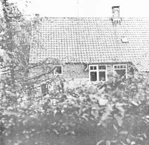
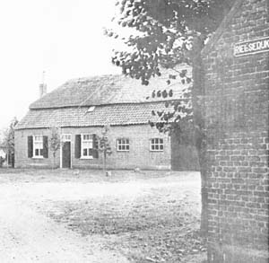
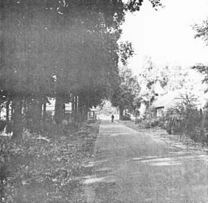
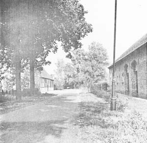

 Riel - een Kempisch gehucht
## 3. Natuur en landschap
### 3.1 Landschappelijke ontwikkeling
*(Bron: Tekst overgenomen uit Oecologisch Verkenning Gijzenrooi hoofdstuk 2.2. dienst gemeentewerken Eindhoven.)*

Reeds in de Romeinse tijd kende men agrarische gehuchten met omgevende akkers, met graasgronden en hooilanden, verkaveld in een blokvormig patroon. Vermoedelijk is de kleine blokvormige verkaveling bij Riel ontstaan met een 7e eeuwse ontginning in een tamelijk vruchtbaar gebied met leemhoudende zandgrond, voor een deel met bos bedekt. Vooral de hogere zanddekken waren goed te bewerken. De stuifduinen, bossen, heide en vennen in de Groote Heide werden echter niet ontgonnen. De heide leverde veel materiaal om de agrarische huishouding mogelijk te maken, zoals plaggen, strooisel, voedsel voor de schapen enzovoort. De bossen leverden vooral wild voor kleding en voedsel; er werden ook varkens in gejaagd om ze vet te mesten. De blokvormige kavels werden omringd door hagen en houtwallen om het vee te weren van de bouwlanden of deze juist erbinnen te houden. Er ontstond zo een landschap met gesloten karakter, in de vakliteratuur we; "bocage-landschap" genoemd, of naar de specifieke Engelse vorm ervan ook wel "enclosures" genaamd.

  
*Westzijde Rielsedijk 23*

Men mag wel aannemen, dat het gehucht Riel in de Merovingische periode bestond uit een groep kleine vrije boeren, die met hun gezinnen kleine landbouwbedrijven exploiteerden. De bedrijfsvoering was eenvoudig en vooral ingesteld op zelfvoorziening. Later is er sprake van de Heerlijkheid Heeze, Leende en Zesgehuchten (11e en 12e eeuw) en verkrijgt een kerkelijke instelling tegen betaling van cijns het recht ten zuiden van Riel woeste gronden te ontginnen. Vermoedelijk werd daar in de 12e eeuw een Einzelhof gevestigd, welke later werd verdubbeld. In de 12e en 13e eeuw heeft de bevolking zich mede door een langdurige economische bloeiperiode flink kunnen uitbreiden en werd de verdere ontginning ter hand genomen. De verdubbelde Einzelhof viel later weer uiteen (vermoedelijk wegensgeldgebrek) in een aantal kleinere boerenhoeven. In de tijd van de republiek werden de boeren schatplichtig aan de Staten-Generaal. Brabant werd als "Generaliteitsland" economisch uitgezogen. De vele rechten, welke de boer van de opbrengst moest betalen an de rechtsher, aan de geestelijkheid, aan kosten voor de vele oorlogen die in Brabant werden uitgevochten en later de vele belastingen aan de Staten-Generaal, droegen bepaald niet bij om de boer aan te zetten tot grote ontginningsactiviteiten. Bovendien was het agrarisch areaal nu eenmaal niet snel uit te breiden voordat er kunstmest verscheen.

Het voorkomen van een groot complex enkeerdgronden om de gehuchten Putten, Riel, Gijzenrooi en Genoenhuis, duiden echter op een eeuwenlang agrarisch gebruik.
Bepaalde enkeerden hebben een dikkere zwarte zandlaag dan andere. Dit kan duiden op een langere gebruiksperiode. Toch bepaalt niet alleen de dikte van de eerdlaag de tijd van ingebruikname; immers, de gronden op grotere afstand van de boerderij werden vaak minder intensief met plaggen bemest. Buiten de gehuchten ontstonden de langgerekte bouwlanden, samengevoegd tot de uitgestrekte achtergronden (de zogenaamde open fields) gelegen ten westen en ten zuiden van Riel, bij Gijzenrooi, Genoenhuis en Hoog Geldrop. Zij onderscheiden zich duidelijk van het "bocage-landschap" rond de gehuchten en in lagere delen van het gebied.
In de vroege middeleeuwen namen cultuurgronden slechts een kleine oppervlakte in en behoorden de heide, de beemden en het broek tot de gemeint; zij werden gemeenschappelijk gebruikt. De latere bevolkingsuitbreidng, de verbeterde landbouwmethoden en de verdere ontginningen vroegen om steeds duidelijkere regelingen en hadden een voortgaande ontginning en verkaveling tot gevolg. Een vochtige laagte als de Gijzenrooise Zegge zal vermoedelijk nog lang gemeint zijn gebleven. daar kon eenieder zijn turf steken, het klotten, waardoor klokputten ontstonden. Hier kon de veengroei dan opnieuw beginnen.
Het behoeft weinig verbeelding dat juist een dergelijk broek een grote rijkdom aan natuurlijke soorten herbergde. Dit kan in mindere mate echter ook gezegd worden van de vele hagen, houtwallen en akkermaalsbosjes bij de gehuchten en langs de lager gelegen percelen en waterlopen.
Hoewel zich in de agrarische historie overgangen hebben voorgedaan van "enclosures" naar "open fields" en omgekeerd, al naar gelang de economische situatie, leende de agrarische sector zich in de historie nu eenmaal niet licht voor uitbreiding van het areaal of omschakeling en was het landschapsbeeld in het algemeen tamelijk statisch. De restanten van de houtwallen rondom Riel en nabij de Gijzenrooise Zegge herinneren daar nog aan. Evenzo de open akkers in het westen, zuiden en oosten van Gijzenrooi.

  
*Noordzijde Rielsedijk 21*

Eerst de industrialisatie, met het opkomende gebruik van kunstmest, puntdraad en de voortgaande mechanisatie brachten ook hier langzaam maar zeker grote veranderingen in het landschapsbeleid. het milieu werd voedselrijker en de natuur verarmde. Eerst na de 2e wereldoorlog echter kwamen de sterke uitbreiding van de bebouwing, de diep insnijdende wegenaanleg van de E3 en de langzame verpaupering van de landbouw in Gijzenrooi. Veel gronden in het gebied werden toen trouwens al opgekocht met het oog op latere stadsuitbreding. Het gehucht Riel bleef tot nu toe redelijk goed bewaard.

### 3.2 Bodem en water
Riel is omgeven door oude landbouwgronden, wat kenbaar is aan de dikte van de donkere (humeuze) homogene (geploegde) bovengrond die in de loop der eeuwen door een jaarlijkse bemesting met aardmest is ontstaan. Het worden enkeerdgronden genoemd. Ieder boerendorp of -gehucht in de zandgebieden is vanouds door een groot areaal enkeerdgronden omgeven. Binnen de agglomeratie Eindhoven nemen ze gezamenlijk circa 20 à 30% van het totale gebied in. Enkeerdgronden zijn dan ook niet zeldzaam. Wel is het zo, dat bij stadsuitbreiding vaak juist deze oude cultuurgronden verloren gaan.

  
*Zuidzijde van Riel 2 en 14*

In de uiterste noordpunt van het gebiedje - namelijk in het bos en daar direct aangrenzend - is de bodem meer oorspronkelijk. Het is een veldpodzolgrond; een bodemtype, dat in Brabant zeer algemeen is op plaatsen waar hei is of voorheen hei was. Hier betreft het een deel van de voormalige Rielsche Heide en het Rielsche Ven, dat in het begin van de vorige eeuw ontgonnen is. Ongestoorde veldpodzolprofielen zijn in de omgeving nog wel aan te treffen, namelijk in de Stratumse Heide.

Het grondwater staat over het algemeen relatief diep beneden het maaiveld. Met uitzondering van het vochtiger bosje, dat in het voormalige Rielsche Ven is aangelegd, betreft het merendeels grondwatertrap IV; namelijk 's  zomers dieper dan 120 cm en 's winters gemiddeld stijgend tot 80 à 40 cm beneden het maaiveld. Het gebied is dus vanuit oecologisch oogpunt tamelijk droog.
Het is mogelijk dat het grondwater vroeger gemiddeld hoger stond en hadden destijds meerdere delen van het gebied een redelijk vochtig milieu en wel met name de terreinen ten westen en zuiden van het oude eikenbos. Ook de sloten en greppels zullen toen vermoedelijk méér en voor langere perioden water bevat hebben.
Het slotensysteem op Riel is in onbruik geraakt, omdat het op verschillende plaatsen onderbroken is.

De voorgenomen stadsuitbreidingen in Eindhoven en Geldrop zullen een verdere daling van de grondwaterstand tot gevolg hebben.

### 3.3 Vegetatie
Bij het oecologisch onderzoek van het buitengebied van Eindhoven dat de dienst gemeentewerken verricht, wordt de vegetatiekundige waarde van een aantal rond Eindhoven gelegen kilometerhokken volgens de “methode Menema” met elkaar vergeleken. De methode is gebaseerd op een inventarisatie van de binnen één vierkante kilometer aanwezige plantensoorten, waarbij aan de hand van de soortenlijst op rekenkundige wijze een vegetatiekundige waarde wordt berekend.

  
Zuidzijde van Riel 9 en 10

Voor het kilometerhok rond Riel resulteert dit niet in een hoge waarde. Dit moet echter als normaal worden beschouwd voor een puur agrarisch gebied op de hogere zandgronden. Het betekent niet, dat de vegetatie rond Riel van weinig betekenis zou zijn. Enerzijds omdat er wel degelijk een aantal plaatsen zijn waar bijzondere soorten voorkomen en waarmee het uitsteekt boven een gemiddeld agrarisch gebied – vooral ten opzichte van jonge heide-ontginningen – en anderzijds omdat de eventuele bescherming van Riel een uitgelezen kans kan bieden om hier de oorspronkelijke rijke flora van akkers, beemden en graslanden in oude glorie te herstellen.

Het in het noorden gelegen bos, kadastraal bekend gemeente Zesgehuchten, sectie B1, nr.2615 (zie kaart 7, onder A) is in de vorige eeuw in een voormalig ven aangelegd. Oorspronkelijk was het een rationeel opgezet hakhoutbos, maar nu is het omgevormd tot een opgaand eikenbos.

Vegetatiekundig behoort het tot de vochtige Eiken-Berken­bossen (Querco roboris – Betuletem molinetosum) met als meest op de voorgrond tredende soorten pijpenstrootje, bochtige smele en wijfjesvaren. Enigszins een bijzonderheid is er het voorkomen van een pluk salomonszegel; een soort die in het algemeen in een voedselrijker milieu voorkomt en waarvan de verspreiding een duidelijk zwaartepunt heeft in de oude cultuurlandschappen.

De bosstrook langs de Groenweg (gemeente Zesgehuchten, sectie B1, nr.2641 zie kaart 7 onder B, gedeeltelijk) heeft een totaal ander karakter. Het is voedselrijker – wat onder meer blijkt uit het dominante voorkomen van gladde witbol en voorts de aanwezigheid van drienerfmuur, valse salie, schermhavikskruid en vogelmuur – en droger, onder meer af te leiden uit het voorkomen van reukgras, schapegras en zachte dravik. Ook in dit bos is voorts een soort aanwezig die vooral in oude cultuurlandschappen voorkomt, namelijk de adelaarsvaren.
Vegetatiekundig is dit bos te rekenen tot de Beuken-Eikenbossen (Fago-Quercetum), welke in de meest typische vorm een oud eikenbos is, waarin salomonszegel, klimop, dalkruid en hazelaar het aspect bepalen.

De zuidelijk gelegen bosstrook (gemeente Stratum, sectie F1, nr.19911 zie kaart 7 onder C – gedeeltelijk) is pas deze eeuw ontstaan. Het is vegetatiekundig sterk verwant met de hiervoor genoemde bosstrook, maar verschilt hiervan door het ontbreken van onder andere adelaarsvaren en door de sterke verstoring die als gevolg van clandestiene vuilstort is ontstaan. Aangrenzend van de weg is er een rommelige begroeiing rijk aan brandnetel, vogelmuur, witte dovenetel, hennepnetel, ridderzuring, paarse dovenetel en bijvoet.

De bestudering van de wegbermen leverde een klein aantal minder algemene soorten op: het algemene beeld is echter betrekkelijk normaal. Enkele bermen worden regelmatig gemaaid en wel eenmaal per jaar door de gemeente en voorts min of meer frequent door particulieren. Door het frequente maaien gaan grassen overheersen en krijgen de kruiden minder kans. Deze bermen bevatten relatief veel echte witbol, kweek, Italiaanse raai, Franse raai en schapegras. Daarnaast komen er nog tal van andere soorten voor als boerenwormkruiod, heermoes, St.Janskruid, berenklauw, vlasbekje, veldzuring en soorten die op betreding en/of bodemverdichting wijzen als grote weegbree, smalle weegbree, Engelse raai, duizendblad, straatgras en varkensgras.
De overige bermen worden over het algemeen niet beheerd en verruigen door opslag van vooral eik, berk, braam, vuilboom, lijsterbes, ratelpopulier, grauwe wilg en geoorde wilg. Voorts zijn hier en daar aanwezig brem, kruipwilg, gagel en inlandse vogelkers. De verruigde bermen worden regelmatig afgebrand. Zeker wanneer dat ’s zomers plaatsvindt is het zeer onrustig voor flora en fauna.
Enkele bermen worden intensief bespoten in verband met het vrijhouden van schrikdraad. Er kan dan een tamelijk open begroeiing ontstaan, waarin tal van pioniersoorten een kans krijgen. In een dergelijke berm werden onder meer de volgende (akker-)onkruiden aangetroffen: akkerhoornbloen, kleien akkerleeuwenklauw, akkerviooltje en eenjarige hardbloem.

Bij de huidige moderne intensieve bedrijfsvoering zijn de akkers en graslanden doorgaans (on-)kruidenarm en zonder zeldzame soorten. Rond Riel liggen evenwel enkele graslandpercelen, die in het voorjaar een zee van paardebloemen te zien geven. Een floristische bijzonderheid is dat uiteraard niet, wel is het uit landschappelijk oogpunt zonder meer fraai te noemen. De paardebloem is een hooggewaardeerd weide-onkruid omdat het de voedingswaarde voor het vee verhoogt. Waar de paardebloem t&equot; sterk gaat overheersen, is het effect echter negatief en wordt er gewoonlijk een chemische bestrijding toegepast.

### 3.4. Fauna
De fauna is tamelijk globaal geïnventariseerd en beperkte zich voornamelijk tot de avifauna. De zeldzaamste broedvogel, die bij de veldwaarneming in 1976 en met 1978 werd aangetroffen, is de roodborsttapuit. Rond Riel broedde er in 1978 zelfs een drietal paartjes. Minder zeldzaam, maar toch zeker vermeldenswaard, is het voorkomen van grasmus, koekoek, gekraagde roodstaart, kneu, gele kwikstaart en tuinfluiter. Het aantal minder algemene soorten is beslist groter dan veelal in een agrarisch gebied het geval is, al bereikt het geenszins de avifaunistische waarde van een natuurgebied als bijvoorbeeld de nabijgelegen Gijzenrooise Zegge.

De verklaring voor de relatief gunstige situatie is, dat het een tamelijk kleinschalig en rijk geschakeerd agrarisch landschap betreft met houtsingles, hagen boomgaarden, ruig begroeide perceelsgrenzen enzovoort. Deze landschapselementen hebben botanisch vaak niet veel te bieden, maar zijn als bron voor de avifauna van grote betekenis als voedselbron, als dekking en/of als broedgelegenheid. Voorts is van belang de nabijheid van de Gijzenrooise Zegge en de in het gebied nog aanwezige rust. Aangezien de rust op den duur grotendeels verloren zal gaan, wordt een goede dekkingsmogelijkheid voor de vogelstand steeds belangrijker. Ook is het ten behoeve van de avifauna gewenst enkele “rusthoekjes”te behouden en te creëren.

### 3.5 Ecologische kwaliteit
De natuur van Riel en omgeving toont duidelijk elementen van een oud natuurlandschap. De daarvoor kenmerkende plantensoorten zijn hier met name adelaarsvaren, klimop en salomonszegel. Betreffende de avifauna is het relatief grote aantal minder algemene soorten te noemen, zoals roodborsttapuit, koekoek, gekraagde roodstaart, gele kwikstaart en kneu. Daarmee bereikt het gebied nog geen hoge oecologische waarde in vergelijking met een natuurgebied. Wel is het waardevoller dan een gemiddeld agrarisch gebied op de hoge zandgronden.
