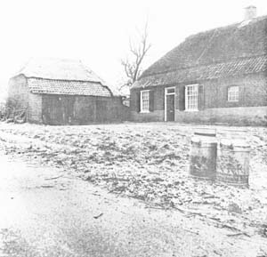

# Riel - een Kempisch gehucht
## Samenvatting en conclusie
Riel ligt in een cultuurhistorisch belangrijk landschap. Riel is niet alleen oud, de eerste ontginningsactiviteiten dateren van de 7e eeuw, maar het nederzettingspatroon is goed bewaard gebleven. Het uitblijven van ontwikkelingen op stedenbouwkundig gebied heeft het stedelijke moderniseringsproces in Riel vertraagd. Door onzekerheid ten aanzien van de toekomst van Riel zijn investeringen in agrarische bedrijven veelal tot een minimum beperkt gebleven.

  
Oostzijde van Riel 11

In het streekplan van Midden- en Oost-Brabant maakt Riel deel uit van een agrarisch gebied met landschappelijke en/of culturele waarde, waarin de landbouw moet kunnen blijven functioneren. Bij een bescherming van Riel moet dan ook hier niet gedacht worden aan een statisch monument, niet aan een museum, maar aan een functionerende agrarische gemeenschap. Veel agrarische elementen zijn nog redelijk ongeschonden. Een zestal (voormalige) boerderijen valt inmiddels al onder de monumentenwet. De bebouwingskwaliteit van de opstallen is over het algemeen redelijk in Riel. De bijgebouwen zijn over het algemeen slecht van kwaliteit.

De boerenbedrijven in Riel zijn nog kleinschalig. De meeste boeren hebben grond in gebruik, waarvan zij geen eigenaar zijn. Zij hebben nog behoorlijk wat gronden in gebruik buiten het gebied Riel. Sommige daarvan liggen in de gevarenzone van toekomstige stadsuitbreidingen, zowel op Eindhovens als Geldrops grondgebied. Tot op heden is een vijftal boerderijen in bezit gekomen van stedelingen. Het is niet te overzien in welke mate dit proces zich zal voortzetten.

De blokvormige verkaveling, omsloten door houtwallen en de langstrokerige akkers zijn in Riel nog steeds te vinden. Door veranderende landbouwmethoden en verminderde diversiteit aan gewassen dreigen in het algemeen historische landschappen en historische verkavelingen aangetast te worden. Ook in Riel is dit niet ondenkbeeldig. Het slotensysteem is in onbruik geraakt. Eventuele stadsuitbreidingen in Eindhoven en Geldrop kunnen de waterhuishouding nog verder aantasten.

De flora en fauna in Riel geven het gebied geen hoge oecologische waarde. Wel is het waardevoller dan een gemiddeld agrarisch gebied op de hoge zandgronden.

Geconcludeerd kan worden, dat de cultuurhistorische kwaliteit dermate hoog is, dat het de moeite waard is dit gehucht in haar historische samenhang te handhaven. Het is noodzakelijk, dat onderzocht wordt op welke wijze Riel behouden kan worden. Een uitvoerbaar bestemmingsplan zal er het resultaat van moeten zijn. De steun van hogere overheden, zeker ook in financieel opzicht, kan daarbij niet gemist worden.

[Volgende > Bijlagen](bijlagen)
