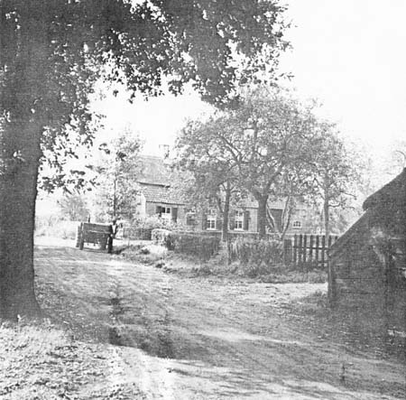

# Riel - een Kempisch gehucht

## Studie naar de waarde van Riel ter verkrijging van het predikaat "Beschermd Dorpsgezicht", oktober 1979

  
*(Bron: Dienst Ruimtelijke Ordening en Verkeer)*

### Inhoudsopgave
Verantwoording  
[1. Inleiding](1.inleiding)  
1.1 Planologische voorgeschiedenis  
1.2 Beleidskader diverse overheden t.a.v. Riel  
1.3 Probleemstelling  
[2. Bebouwing en grondgebruik](2.bebouwing)  
1.2 Stedebouwkundige ontwikkeling  
2.2 Aard van de bebouwing  
2.3 Bebouwingskwaliteit  
2.4 Eigendommen en grondgebruik  
[3. Natuur en landschap](3.natuur)  
3.1 Landschappelijke ontwikkeling  
3.2 Bodem en water  
3.3 Vegetatie  
3.4 Fauna  
3.5 Ecologische kwaliteit  
[4. Verkeer](verkeer)  
[Samenvatting en conclusie](conclusie)  
[Bijlagen en bronnen](bijlagen)  
Bijlage 1: Procedure van aanwijzing tot beschermd stads- of dorpsgezicht  
Bijlage 2: Samenvattingen van gesprekken met bewoners van Riel  
Gebruikte bronnen  

### Verantwoording

Het onderhavige rapport omvat de resultaten van de ambtelijke werkgroep Riel.  
Bij brief van 20 juni 1977 deelden burgemeester en wethouders de directeur van de dienst ruimtelijke ordening en verkeer mede, dat zij besloten hadden een werkgroep Riel in te stellen. Op verzoek van burgemeester en wethouders heeft de directeur de heer Ir. A.J.Kuperus met het voorzitterschap van de werkgroep belast.

De werkgroep Riel was als volgt samengesteld:
- mej. M.Bakermans, afdeling juridische zaken dienst R.O.V.
- Th.v.d.Boom, ambtelijk vertegenwoordiger van de gemeente Geldrop
- F.Fontaine, hoofd afdeling plantsoenen van de dienst gemeente werken
- Ir. H.Franke, afdeling plantsoenen van de dienst gemeente werken
- Drs. L.van Geuns, afdeling stedebouwkundig onderzoek dienst R.O.V.
- A.D.Kakebeeke, adjunct-archivaris van de gemeente Eindhoven
- Ir. G.Kieviets, directeur dienst bouw- en woningtoezicht
- Ir. A.J.Kuperus, hoofd van de hoofdafdeling stadsontwikkeling dienst R.O.V.

Tijdelijk hebben de heren A.Naalden en F.Vervest deelgenomen aan de werkgroep, teneinde de heer A.D.Kakebeeke tijdens diens ziekteperiode te vervangen.  
De fotograaf R.van Mielo verzorgde de foto’s, de heer A.van Almen het kaartmateriaal.  
De afdeling stedebouwkundig onderzoek heeft het rapport samengesteld.

[1. Inleiding](inleiding)
