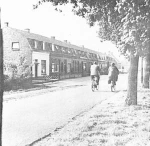

###### Riel - een Kempisch gehucht

## 4. Verkeer
Riel is verkeerskundig gezien een betrekkelijk slecht ontsloten gebied waardoor het geïsoleerd ligt ten opzichte van Eindhoven en Geldrop. De belangrijkste ontsluitingsweg is de Rielsedijk. Deze is vooral voor fietsers een verbindingsweg van Eindhoven naar Geldrop. Verkeer in zuidelijke richting is van weinig betekenis.

  
*Noordzijde Rielsedijk 25 t/m 49*

Op de Rielsedijk wordt wel hard gereden. Dit is mogelijk doordat de Rielsedijk buiten de bebouwde kom ligt en dus de maximum snelheid van 50 km hier niet geldt.
De Rielsedijk is verhard (asfalt) tot aan Riel 21 toe. De noord-zuidverbinding die de Rielsedijk kruist is verhard tot Riel 9. Behoudens enkele kleinere onderdelen zijn alle overige wegen op Riel onverhard.

---
#### Inhoud 'Riel - een Kempisch gehucht'
[Verantwoording](index)  
[1. Inleiding](1.inleiding)  
[2. Bebouwing en grondgebruik](2.bebouwing)  
[3. Natuur en landschap](3.natuur)  
4\. Verkeer  
[Samenvatting en conclusie](conclusie)  
[Bijlagen en bronnen](bijlagen)  
