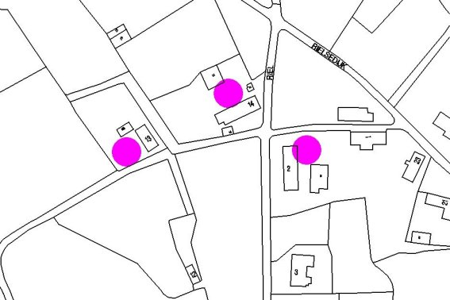

# Monumenten in Riel

In Riel zijn drie boerderijen aangewezen als Rijksmonument, daarnaast heeft het gehucht Riel sinds 1987 de status van beschermd dorpsgezicht.

## Monumenten in Riel:
* [Riel 2](riel2), Kempense langgevelboerderij
* [Riel 13](riel13), Kempense langgevelboerderij
* [Riel 14](riel14), Kempense langgevelboerderij
* [Riel beschermd dorpsgezicht](dorpsgezicht)

### Siuatiekaart:

  
*Bron: © 2001 Gemeente Eindhoven*

## De langgevelboerderij
De provincie Noord-Brabant kent door zijn omvang en verschil in bodem een aantal soorten boerderijen.
Deze zijn echter allemaal terug te voeren op een zelfde oorsprong: het hallehuis.
Bij dit type boerderij bevinden de woning en het bedrijfsgedeelte zich onder een dak en zijn meestal gescheiden door een muur.
De behoefte aan meer opslagruimte voor de oogst was aanleiding om de indeling van het bedrijfsgedeelte te wijzigen.
Behalve in het westen van de provincie had dit tot gevolg dat de grote deeldeuren in de achtergevel werden verplaatst naar de zijgevels.
Ook was het zo mogelijk om de boerderijen aan de achterzijde te verlengen, wat met name in het midden en oosten van de provincie gebeurde.
In deze streken deed zich ook aan de woningzijde van de boerderij een dergelijke ontwikkeling voor.
De oudste vorm hiervan is de hoekgevelboerderij, waarbij tegen de ene helft van de voorgevel een kamer werd uitgebouwd.
In het overblijvende gedeelte bleven dan de voordeur en een raam gehandhaafd. Naderhand werd de open hoek ook volgebouwd.
De voordeur kwam zodoende in de zijgevel. Dit boerderijtype met alle toegangen in de zijgevels is bekend onder de naam langgevelboerderij.
Dit is voor de zandgronden van de provincie Noord-Brabant het meest karakteristieke type.
