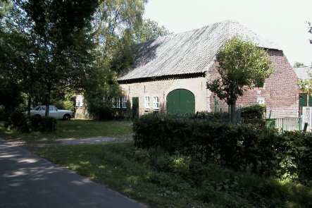
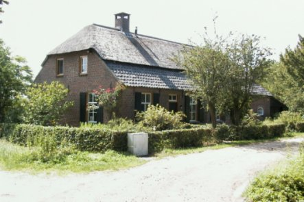
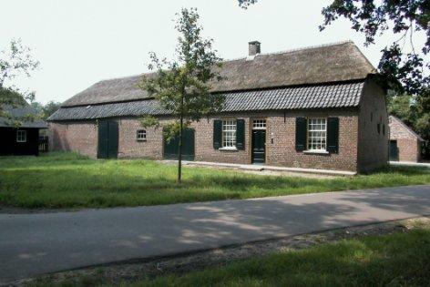
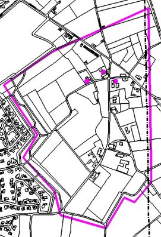

# Monumenten in Riel

In Riel zijn drie boerderijen aangewezen als Rijksmonument, daarnaast heeft het gehucht Riel sinds 1987 de status van beschermd dorpsgezicht.

## Monumenten in Riel:
* [Riel 2](#riel2), Kempense langgevelboerderij
* [Riel 13](riel13), Kempense langgevelboerderij
* [Riel 14](riel14), Kempense langgevelboerderij
* [Riel beschermd dorpsgezicht](dorpsgezicht)

### Siuatiekaart:

  
*Bron: © 2001 Gemeente Eindhoven*

### De langgevelboerderij
De provincie Noord-Brabant kent door zijn omvang en verschil in bodem een aantal soorten boerderijen.
Deze zijn echter allemaal terug te voeren op een zelfde oorsprong: het hallehuis.
Bij dit type boerderij bevinden de woning en het bedrijfsgedeelte zich onder een dak en zijn meestal gescheiden door een muur.
De behoefte aan meer opslagruimte voor de oogst was aanleiding om de indeling van het bedrijfsgedeelte te wijzigen.
Behalve in het westen van de provincie had dit tot gevolg dat de grote deeldeuren in de achtergevel werden verplaatst naar de zijgevels.
Ook was het zo mogelijk om de boerderijen aan de achterzijde te verlengen, wat met name in het midden en oosten van de provincie gebeurde.
In deze streken deed zich ook aan de woningzijde van de boerderij een dergelijke ontwikkeling voor.
De oudste vorm hiervan is de hoekgevelboerderij, waarbij tegen de ene helft van de voorgevel een kamer werd uitgebouwd.
In het overblijvende gedeelte bleven dan de voordeur en een raam gehandhaafd. Naderhand werd de open hoek ook volgebouwd.
De voordeur kwam zodoende in de zijgevel. Dit boerderijtype met alle toegangen in de zijgevels is bekend onder de naam langgevelboerderij.
Dit is voor de zandgronden van de provincie Noord-Brabant het meest karakteristieke type.

## Riel 2, Kempense langgevelboerderij
Rijksmonument  
Bouwjaar: 1876

  
*(Foto: gemeente Eindhoven, dienst SOB)*

Kempense langgevelboerderij onder pannen wolfdak. De inrijpoorten zijn getoogd. In het woongedeelte vensters met zesruits schuiframen en luiken. De schuur heeft eveneens een met pannen gedekt wolfdak.
Het bouwtype is cultuurhistorisch waardevol en getuigt van een vroegere leefwijze.

De boerderij vormt samen met andere de kern van het gehucht Riel.

## Riel 13, Kempense langgevelboerderij
Rijksmonument  
Bouwjaar: vóór 1850

*(Foto:gemeente Eindhoven, dienst SOB, Arnoud Wakkerman)*

Kempense langgevelboerderij met wolfdak gedekt met riet en pannen. In het woongedeelte vensters met zesruits schuiframen en luiken. Op het erf staan een stenen schuur, een houten karrenschop en een bakhuis.
Het bouwtype is cultuurhistorisch waardevol en getuigt van een vroegere leefwijze.

De boerderij vormt samen met andere de kern van het gehucht Riel.

## Riel 14, Kempense langgevelboerderij
Rijksmonument  
Bouwjaar: vóór 1850

  
*(Foto:gemeente Eindhoven, dienst SOB, Arnoud Wakkerman)*

Kempense langgevelboerderij met wolfdak gedekt met riet en pannen. In 1877 na een brand herbouwd. In het woongedeelte vensters met schuiframen, kleine roedenverdeling en luiken. Op het erf staan een houten karrenschop en een bakhuis. In het interieur bevindt zich nog een oude schouw.
Het bouwtype is cultuurhistorisch waardevol en getuigt van een vroegere leefwijze.

De boerderij vormt samen met andere de kern van het gehucht Riel.

## Beschermd dorpsgezicht Riel
Rijksmonument

  
*situatie Riel*
Riel is een gehucht waar de landschapsstructuur van kleinschalige akkers en de beplanting van wegen en erven, in de eerste helft van de 20e eeuw nog zo karakteristiek voor het buitengebied, gaaf bewaard is gebleven. Het is een voorbeeld van een beekdalnederzetting, deels gelegen op een kleine dekzandrug De Donck, deels aan de rand van het dal van de Lakerloop.
Centraal in het gehucht ligt een eikenweide met een brand- of drenkkuil.  
Tot 1921 hoorde het gebied bij de gemeente Zesgehuchten en tot 1972 bij Geldrop.
