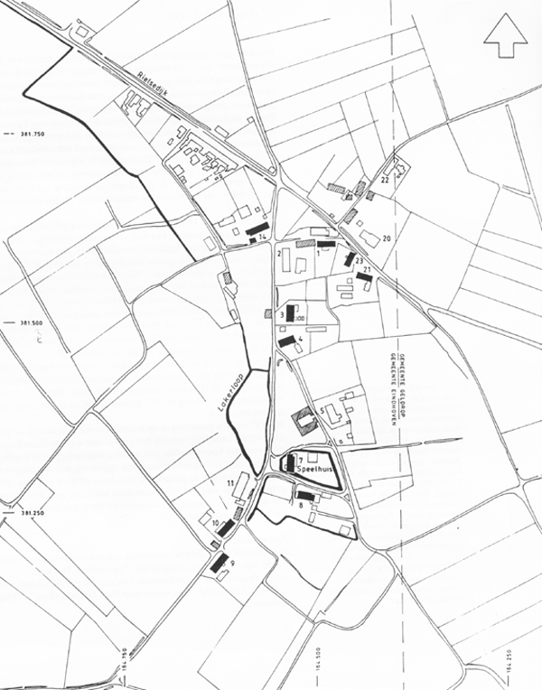

#### Het bodemarchief van een langgevelboerderij te Riel

## Huidige topografie van het gehucht Riel

  
Afbeelding 1: Huidige topografie van het gehucht Riel (tekening: Ben van den Broek).

### Legenda
- Huidige topografie van het gehucht Riel met vroegere en bestaande bebouwing.
- Gearceerde blokken: bebouwing in 1832 (thans verdwenen);
- zwarte blokken: bestaande bebouwing op dezelfde plaats als in 1832;
- witte blokken: bebouwing van na 1832.

- Getallen zijn de huidige huisnummers; Rielsedijk 21 is de opgegraven boerderijplaats.  
- Zwarte lijnen; water (beek en gracht) in 1832.  
- Schaal 1:4000
