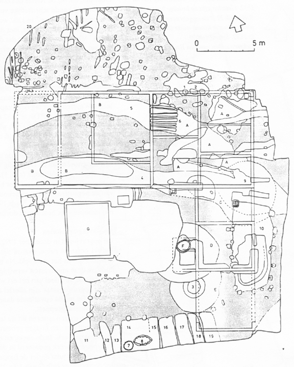

##### Het bodemarchief van een langgevelboerderij te Riel

## Het bodemarchief van Rielsedijk nr.21

Het bodemarchief van Rielsedijk nr.21 met de funderingen van de in 1991 afgebrande boerderij.

  
*Afbeelding 2: Het bodemarchief van Rielsedijk nr.21  
(tekening: Nico Arts)*

### Legenda en datering:
- grijs: ongestoord dekzand;
- 1 en 2: laatmiddeleeuwse paalsporen (1350-1500);
- 3: plaggenput op karrewiel met insteek (ca. 1500);
- 4 en 5: greppels (1700-1775);
- 6: resten houten brug (1700-1775);
- 7: waterput van vlechtwerk (1700-1775);
- 9: niet nader geïdentificeerde kuil (1700-1775);
- 10: houten postal (?) met rechts langs de ingang een bakstenen poer (ca. 1775);
- 11-19: 'langebedden' (19de eeuw);
- 20: karresporen (19de/20ste eeuw).

Fundamenten:
- A: woongedeelte met in het zuidoosten kelder onder opkamer (eind 18de eeuw);
- B: potstal (19de/20ste eeuw);
- C: potstal (begin 20ste eeuw);
- D: paardestal (begin 20ste eeuw);
- E: schuur (20ste eeuw);
- F: bakstenen waterput met insteek (begin 20ste eeuw);
- G: beerkelder (20ste eeuw).

Het gedeelte midden in de opgravingsput tussen G en F is niet opgegraven.  
Schaal 1:200
