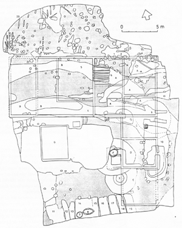

##### Het bodemarchief van een langgevelboerderij te Riel

## Opgravingsresultaten
De opgraving is in december 1992 begonnen met het voorzichtig opruimen van de in 1991 ontstane ruïne, daarna zijn de bovengrondse resten gesloopt tot enkele decimeters boven het maaiveld. na het onderzoek van de bakstenen funderingen zijn ook deze muurresten verwijderd, en is een grote opgravingsput aangelegd, waarbij ook een deel van het erf werd betrokken.

In het opgravingsvlak zijn allerlei archeologische relevante sporen aangetroffen (afb. 2). De meest opvallende daarvan zijn reeksen paalsporen, vier waterputten en een tweetal greppels.

De oudste sporen dateren uit de late middeleeuwen. Het gaat hierbij om twee paalsporen van een houten gebouw, waarin scherven zijn gevonden van grijs gedraaid aardewerk. In de regio, en ook elders in het zuiden van Nederland, wordt dit type aardewerk gedateerd in de periode ca. 1325/50-1500. De beide paalsporen bevonden zich juist onder de funderingen van de bakstenen boerderij, precies onder de voordeur (afb. 2 nrs. 1 en 2). Elders in het opgravingsvlak zijn nog meer paalsporen gevonden, maar deze zijn altijd ondieper dan de voorgaande, en vanwege het ontbreken van vondsten veelal ondateerbaar. Meestal zal het bij deze paalsporen om exemplaren gaan die dateren uit de achttiende, negentiende en twintigste eeuw.

Een derde grondspoor, dat uit het einde van de middeleeuwen dateert, is een op de velg van een karrewiel gefundeerde plaggenput (afb. 2 nr. 3.). De beide paalsporen en de waterput tonen aan, dat de bebouwing van deze boerderijplaats in elk geval teruggaat tot omstreeks 1500. De aard en omvang is vanwege het ontbreken van meer aanwijzingen evenwel onbekend.

  
*Afbeelding 2: Het bodemarchief van Rielsedijk nr.21 met de funderingen van de in 1991 afgebrande boerderij.  
([Vergrote afbebeelding met legenda](afbeelding2))
(tekening: Nico Arts)*

Het terrein lijkt gedurende de zestiende en zeventiende eeuw niet bewoond te zijn geweest, want sporen uit die tijd ontbreken geheel. Vanaf het begin van de eeuw daarna is dat echter wel het geval. Opvallende overblijfselen uit de periode 1700-1775 zijn een tweetal gebogen greppels, waarvan in het bovenste vlak van de meest noordelijke de verkleuringen werden ingetekend van planken van een houten brug (afb. 2 nr. 6a). Mogelijk vormen deze greppels gedeelten van de erfafscheiding van een huisplaats, maar van dat huis zelf zijn geen sporen gevonden.

Wanneer dat huis archeologisch nog aantoonbaar zou zijn, kan dit zich ten zuiden van het opgravingsterrein hebben bevonden. Tot dat huis zullen de beide waterputten hebben behoord, die in het zuiden van het opgravingsvlak werden aangetroffen (afb. 2 nrs. 7 en 8). De jongste daarvan is geconstrueerd uit een houten vlechtwerk, de andere bestaat uit een plaggenput op de velg van een karrewiel. De beide greppels komen ter hoogte van een diepe 'kuil' bij elkaar (afb. 2 nr. 9) en lopen daarna verder door als één greppel tot buiten de opgravingsput.

Blijkens het daarin gevonden vondstmateriaal zullen zowel de greppels als de 'kuil' omstreeks 1775 zijn gedempt. Vervolgens is gedeeltelijk op de gedempte 'kuil' een merkwaardig houten gebouwtje gezet (afb. 2 nr. 10). Dit heeft afmetingen van maximaal 4 x 8,5 m. De asymmetrische éénschepige plattegrond heeft aan drie zijden ondiepe paalsporen, langs de ingang in het noorden staat aan één zijde een bakstenen poer. Het verdiepte vloerniveau bevindt zich enkele decimeters beneden het opgravingsvlak: in de vulling werd zwart, vettig zand aangetroffen. De functie van dit primitief bouwsel is niet zeker. Wellicht is het een restant van een potstal, een andere mogelijkheid is dat het om de overblijfselen van een plaggenhut gaat.

De laatste hier genoemde grondsporen bestaan uit een reeks 'langebedden', die uit de negentiende eeuw dateren. Ze bevinden zich geheel in het zuiden van de opgravingsput en lopen door tot daarbuiten (afb. 2 nrs. 11-19). Dergelijke sporen worden herhaaldelijk aangetroffen in de regio, en komen ook elders voor op de Nederlandse en Vlaamse zandgronden. Dikwijls wordt aangenomen, dat dit de overblijfselen zijn van zandwinning. Aannemelijker is echter, dat deze ontstaan zijn door tuinbouw; het betreft dan de overblijfselen van vroegere moestuinbedden.*)Voetnoot: Van den Dries 1989. In het geval van Riel maakt de locatie op het erf van een boerderij dit waarschijnlijker.

## De bakstenen boerderij
Tijdens het onderzoek van de fundamenten van de boerderij is komen vast te staan, dat deze meerdere bouwfasen vertegenwoordigen. De oudste bouwfase is jonger dan de greppels waarop ze is gebouwd, en vermoedelijk ook jonger dan het houten bouwsel. Het vondstmateriaal uit deze greppels duidt erop, dat de bakstenen boerderij in elk geval jonger is dan ca. 1775. Waarschijnlijk dateert deze in eerste aanleg uit het laatste kwart van de achttiende eeuw.

De oudste bakstenen bouwfase bestaat uit een blokvormig gebouw met degelijk uitgevoerde fundamenten (afb. 2: A). Dit zal vanouds het woongedeelte hebben gevormd; in het zuidoosten bevindt zich de voor langgevelboerderijen kenmerkende kelder onder de opkamer. Blijkens de oudtse kadastrale gegevens moet zich ten westen van dit woongedeelte het stalgedeelte hebben bevonden. Vermoedelijk heeft dit een gebintconstructie op bakstenen poeren gehad, maar er is geen enkel spoor van een poer teruggevonden. In een latere fase zijn de (oorspronkelijk houten of lemen?) wanden van het stalgedeelte vervangen door ondiep in de grond gefundeerde bakstenen muren (afb. 2: B). Dit hele stalgedeelte heeft een ongeveer één meter diepe potstal gehad. Een twintig-eeuwse uitbreiding van de boerderij ligt tegen het zuiden van het woongedeelte, bestaand eruit een kleine potstal, een paardestal en een schuur (afb. 2: resp. C, D, E). Eveneens uit de twintigste eeuw dateert een bakstenen waterput, die gedeeltelijk door de laatmiddeleeuwse put is aangelegd (afb. 2: F). Waterputten uit de oudste bouwfase en uit de negentiende eeuw zijn niet gevonden, deze bevinden zich ongetwijfeld buiten het archeologisch onderzochte terreindeel. Uit het begin van deze eeuw, ten slotte, dateert een diep in de bodem ingegraven betonnen beerkelder (afb. 2: G). Deze werd overigens pas ontdekt, toen de voor het archeologisch onderzoek ingehuurde graafmachine er in viel.

---
### Inhoud
- [Inleiding](inleiding)
- [Het gehucht Riel](gehuchtriel)
- [Opgravingsresultaten](opgraving)
- [De bakstenen boerderij](opgraving#boerderij)
- [Vondsten](vondsten)
- [Botanisch onderzoek](botanisch)
- [Conclusies](conclusies)
- [Literatuur](conclusies#literatuur)

