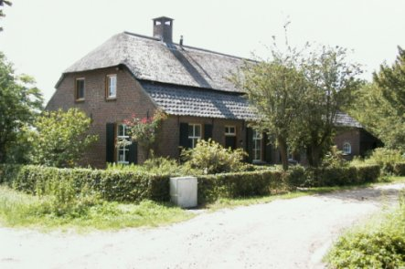

# Riel 13, Kempense langgevelboerderij

Rijksmonument  
Bouwjaar: vóór 1850

  
*(Foto: gemeente Eindhoven, dienst SOB, Arnoud Wakkerman)*

Kempense langgevelboerderij met wolfdak gedekt met riet en pannen. 
In het woongedeelte vensters met zesruits schuiframen en luiken. 
Op het erf staan een stenen schuur, een houten karrenschop en een bakhuis.
Het bouwtype is cultuurhistorisch waardevol en getuigt van een vroegere leefwijze.

De boerderij vormt samen met andere de kern van het gehucht Riel.
