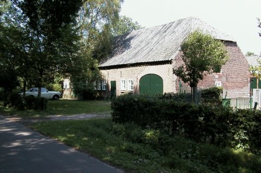

# Riel 2, Kempense langgevelboerderij

Rijksmonument  
Bouwjaar: 1876

  
*(Foto: gemeente Eindhoven, dienst SOB)*

Kempense langgevelboerderij onder pannen wolfdak. De inrijpoorten zijn getoogd. 
In het woongedeelte vensters met zesruits schuiframen en luiken. 
De schuur heeft eveneens een met pannen gedekt wolfdak.
Het bouwtype is cultuurhistorisch waardevol en getuigt van een vroegere leefwijze.

De boerderij vormt samen met andere de kern van het gehucht Riel.
